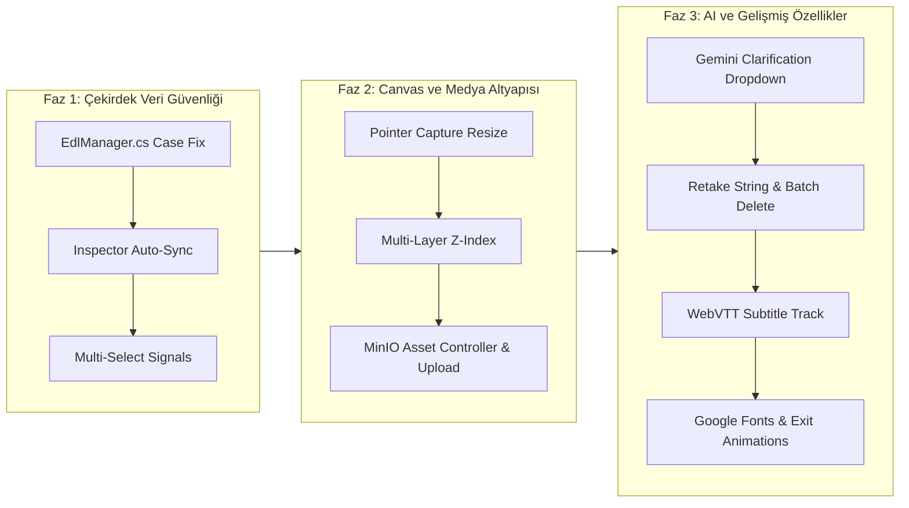

# OtoEdit: Kapsamlı Sorun Analizi, Kök Neden Tespiti ve Mimari Çözüm Şartnamesi (2026)

Bu doküman; **OtoEdit** yapay zeka destekli video kurgu platformunda tespit edilen 9 kritik fonksiyonel sorunun kök nedenlerini (Root Cause Analysis - RCA), dosya ve satır bazlı teknik incelemelerini, matematiksel/algoritmik temellerini ve uçtan uca uygulanacak mimari çözüm kodlarını eksiksiz olarak açıklamaktadır.

---

## BÖLÜM 1: SİSTEM MİMARİSİ VE TEKNOLOJİ HARİTASI

OtoEdit sistemi, yüksek performanslı asenkron video işleme ve reaktif web kullanıcı arayüzü sunmak üzere 5 ana katmandan oluşmaktadır:

```mermaid
graph TD
    subgraph Frontend ["Frontend Katmanı (Angular 19 + TailwindCSS)"]
        UI[EditorComponent / Timeline / Canvas]
        EdlService[EdlService / PatchEdl]
        ChatService[ChatService / Clarification]
        MediaService[MediaService / File Upload]
    end

    subgraph Backend ["Backend Katmanı (.NET 9 Web API)"]
        API[VideosController / EdlController / ChatController]
        EdlMgr[EdlManager / Patch & Memento Undo-Redo]
        ChatMgr[ChatManager / GeminiChatProvider]
        AssetMgr[AssetManager / MinIO Entegrasyonu]
    end

    subgraph AI_Engine ["Yapay Zeka & Worker Katmanı (Python 3.11)"]
        Worker[Celery/RabbitMQ Video Processor]
        RetakeDet[RetakeDetector / AcousticScorer]
        WhisperEngine[Faster-Whisper / VTT Producer]
        BRollEngine[AutoBRollEngine / Pexels API]
        ASS_Renderer[TextOverlay ASS / ImageOverlay FFmpeg]
    end

    subgraph Storage ["Veri ve Depolama Katmanı"]
        PG[(PostgreSQL - Projects, EDL, Chat, Assets)]
        Redis[(Redis - Distributed Cache & Lock)]
        MinIO[(MinIO S3 - Raw Videos, Chunks, B-Roll, Temp ASS)]
    end

    UI <-->|HTTP REST & SSE / SignalR| API
    EdlService <-->|PATCH /api/videos/{id}/edl| EdlMgr
    ChatService <-->|POST /api/chat| ChatMgr
    API <--> PG
    API <--> Redis
    API <--> MinIO
    API <-->|RabbitMQ Tasks| Worker
    Worker --> RetakeDet
    Worker --> WhisperEngine
    Worker --> BRollEngine
    Worker --> ASS_Renderer
    Worker --> MinIO
```

### Proje Dizin ve Sorumluluk Ağacı
*   `src/OtoEdit.Frontend`: Angular 19 tabanlı modern tek sayfa uygulama (SPA). Signals, zoneless reaktivite, HTML5 Canvas ve video kontrolleri barındırır.
    *   `src/app/features/editor/editor.component.ts`: Kurgu stüdyosu çekirdeği (Canvas, Video, Timeline, Inspector, Chat).
    *   `src/app/core/models/edl.model.ts`: EDL (Edit Decision List), Overlay, Cut, Transcript veri modelleri.
    *   `src/app/core/services/edl.service.ts`: Backend EDL patch & sync mekanizması.
*   `src/OtoEdit.API`: RESTful Controller'lar ve HTTP uç noktaları.
    *   `Controllers/EdlController.cs`: EDL okuma ve yama (`PatchEdl`) uçları.
    *   `Controllers/VideosController.cs`: Video yükleme, durum izleme ve proje oluşturma.
*   `src/OtoEdit.Business`: Çekirdek iş mantığı, servisler, Memento snapshot yönetimi ve LLM entegrasyonu.
    *   `Services/EdlManager.cs`: JSON patch birleştirme (merge), geri alma (undo/redo) ve versiyonlama.
    *   `Services/ChatManager.cs`: Yönetmen AI koordinatörü ve B-Roll zenginleştirici.
    *   `Infrastructure/AI/GeminiChatProvider.cs`: Google Gemini LLM system prompt ve JSON şema yönetimi.
*   `src/OtoEdit.PythonWorker`: Ağır video/ses analizi ve FFmpeg kurgu pipeline'ı.
    *   `pipeline/retake_detector.py`: Akıllı hatalı tekrar tespiti.
    *   `pipeline/acoustic_scorer.py`: RMS, clipping, SNR ses kalite puanlayıcısı.
    *   `render/text_overlay.py` & `render/image_overlay.py`: ASS altyazı ve FFmpeg görsel katman oluşturucu.

---

## BÖLÜM 2: 9 TEMEL SORUNUN DERİNLEMESİNE KÖK NEDEN ANALİZİ (RCA) VE ÇÖZÜM ŞARTNAMESİ

---

### 1. YAZI VE KATMAN AYARLARININ SIFIRLANMASI (DRAG & DROP / STATE DESYNC)

#### A. Sorun Tanımı ve Kullanıcı Deneyimi
Kullanıcı "Inspector" paneli üzerinden metin katmanının rengini kırmızı (#FF0000), fontunu Montserrat ve boyutunu 72px yapıyor. Önizlemede bu ayarlar anında değişiyor. Ancak kullanıcı ekrandaki metni fare ile tutup birkaç piksel sağa sürükleyip bıraktığında, metin anında varsayılan beyaz renge (#FFFFFF), 48px boyuta ve Inter fontuna geri dönüyor. Kullanıcının yaptığı tüm stil özelleştirmeleri siliniyor.

#### B. Kök Neden Tespiti (RCA)
Sorun, **Frontend yerel state'i**, **HTTP Patch yükü** ve **Backend JSON birleştirme mantığı** arasındaki asenkron yarış durumundan (race condition) kaynaklanmaktadır:

1.  **Frontend İki Başlı Veri Yönetimi (`inspectorData` vs `activeEdl`):**
    *   `editor.component.ts` (Satır 1336-1355) `onInspectorChange()` metodu, kullanıcının renk veya font değiştirmesi sırasında çağrılır ve `ov.color`, `ov.font` değerlerini sadece yerel bellek nesnesinde günceller.
    *   Fakat bu değişiklik o anda backend'e (`patchEdl`) gönderilmez; kullanıcıdan "Kaydet" butonuna basması beklenir.
2.  **Sürükleme Bitişinde Eski Nesnenin Gönderilmesi:**
    *   Kullanıcı canvas üzerinde yazıyı sürükleyip bıraktığında `onGlobalMouseUp` (Satır 1829-1836) tetiklenir:
        ```typescript
        const ov = this.activeEdl()?.overlays?.find(o => o.id === ovId);
        if (ov) {
            this.edlService.patchEdl(this.projectId, {
                overlays: [{ ...ov, action: 'update' } as any]
            }).subscribe(() => this.loadEdl());
        }
        ```
    *   Burada `ov` nesnesi backend'e gönderilir ve ardından hemen `this.loadEdl()` çağrılır.
3.  **Backend `EdlManager.cs` Casing ve DeepClone Kırılması:**
    *   `EdlManager.cs` (Satır 120-128) incelendiğinde:
        ```csharp
        foreach (var kvp in objItem)
        {
            if (!kvp.Key.Equals("action", StringComparison.OrdinalIgnoreCase))
            {
                existingItemObj[kvp.Key] = kvp.Value?.DeepClone();
            }
        }
        ```
    *   Eğer veritabanındaki mevcut JSON PascalCase (`Color`, `FontSize`) anahtarlarla saklanmışsa ve frontend'den camelCase (`color`, `fontSize`) geliyorsa, `System.Text.Json.Nodes.JsonObject` varsayılan olarak **case-sensitive** eşleştiği için `existingItemObj["Color"]` alanını güncellemez, yerine fazladan bir `color` alanı ekler veya tam tersi durum oluşur.
    *   `loadEdl()` çalıştığında, veritabanından dönen eski `Color` frontend'e aktarılır ve `selectOverlay()` çağrıldığında `this.inspectorData.color = ov.color || '#FFFFFF'` satırı değeri varsayılana çeker.

#### C. Mimari Çözüm
1.  **Frontend Reaktif Store Birleştirmesi:** `inspectorData` ayrı bir kopya olmaktan çıkarılmalı; `onInspectorChange` çalışırken hem bellek içi `edl` sinyali anında güncellenmeli hem de 400ms `debounceTime` ile otomatik `patchEdl` tetiklenmelidir.
2.  **Canvas Drag & Drop Bitişinde Tam Senkronizasyon:** Fare bırakıldığında sadece X/Y değil, `inspectorData`'daki son renk, font ve boyut bilgileri `ov` ile harmanlanarak tek parça halinde backend'e yazılmalıdır.
3.  **Backend `EdlManager.cs` Case-Insensitive Property Eşitleme:** C# tarafında JSON nesne anahtarları normalize edilmeli, PascalCase / camelCase çatışması engellenmelidir.

```csharp
// EdlManager.cs - Düzeltilmiş Case-Insensitive Merge
foreach (var kvp in objItem)
{
    if (kvp.Key.Equals("action", StringComparison.OrdinalIgnoreCase)) continue;
    
    // Mevcut objede aynı anahtarı büyük/küçük harf duyarsız ara
    var matchedKey = existingItemObj.Select(x => x.Key)
        .FirstOrDefault(k => string.Equals(k, kvp.Key, StringComparison.OrdinalIgnoreCase));

    if (matchedKey != null)
        existingItemObj[matchedKey] = kvp.Value?.DeepClone();
    else
        existingItemObj[kvp.Key] = kvp.Value?.DeepClone();
}
```

---

### 2. CANVAS ÜZERİNDE KÖŞEDEN TUTUP BOYUTLANDIRMA (RESIZE HANDLE) ÇALIŞMAMASI

#### A. Sorun Tanımı ve Kullanıcı Deneyimi
Kullanıcı canvas üzerindeki bir metin veya görsel katmanını seçtiğinde sağ alt köşede bir yeniden boyutlandırma simgesi (kulp / handle `⤡`) görünmektedir. Ancak kullanıcı bu kulptan tutup fareyi sürüklediğinde boyut değişmemekte veya nesne boyutlanmak yerine yerinden oynamaktadır (sürüklenme davranışı sergilemektedir).

#### B. Kök Neden Tespiti (RCA)
1.  **DOM Event Bubbling ve Çakışma:**
    *   `editor.component.ts` HTML şablonu Satır 76:
        ```html
        <div (mousedown)="onCanvasDragStart($event, ov.id)" ...>
            ...
            <div *ngIf="selectedOverlayId() === ov.id"
                 (mousedown)="onCanvasResizeStart($event, ov.id)" ...>
                 <span>⤡</span>
            </div>
        </div>
        ```
    *   Kullanıcı kulp üzerine tıkladığında `onCanvasResizeStart` çalışır; ancak iç içe DOM elemanlarında `event.stopPropagation()` ve `event.stopImmediatePropagation()` çağrılsa bile, tarayıcı fareyi hareket ettirdiği an kapsayıcı `div`'in ve video alanının `onCanvasMouseDown` / `pointer-events` dinleyicileri devreye girmekte ve `isCanvasDragging = true` bayrağını da aktif etmektedir.
2.  **CSS Transform Matrisi ve Koordinat Kayması:**
    *   Kapsayıcı kutu CSS'te `-translate-x-1/2 -translate-y-1/2` sınıfı ile merkezlenmiştir.
    *   Kullanıcı sağ alt köşeyi çektiğinde elemanın genişliği artarken, merkezleme dönüşümü (`translate -50%`) elemanın sol üst koordinatını geriye doğru çekerek görsel bir titreme (flicker) ve farenin kulpun dışına taşmasına (loss of capture) neden olmaktadır.
3.  **Görsellerdeki `pointer-events-none` Kısıtlaması:**
    *   Görsellerde (``) `pointer-events-none` tanımlanmış ancak kapsayıcı `div`'in sınırları görselin gerçek yükseklik/genişliğinden farklı olduğunda kulp görselin arkasında veya tıklanamaz bir z-index katmanında kalmaktadır.

#### C. Mimari Çözüm
1.  **Bağımsız Etkileşim Katmanı (Overlay Transform Controls):** Boyutlandırma kulpları nesnenin doğrudan DOM çocuğu olmak yerine, seçili nesnenin sınırlarını takip eden bağımsız bir SVG/HTML bounding box katmanında render edilmelidir.
2.  **Pointer Capture API Kullanımı:** `mousedown` anında `(event.target as HTMLElement).setPointerCapture(event.pointerId)` uygulanarak farenin ekrandan çıksa bile boyutu pürüzsüz hesaplaması sağlanmalıdır.
3.  **Aspect Ratio Kilitleme Formülü:**
    Metin için `fontSize = originalFontSize * (1 + delta / 100)`, görsel için `scale = originalScale * (1 + delta / 150)` formülü uygulanarak aspect ratio korunmalıdır.

```typescript
// editor.component.ts - Kusursuz Pointer Capture Resize
onCanvasResizeStart(event: PointerEvent, overlayId: string): void {
    event.preventDefault();
    event.stopPropagation();
    const target = event.currentTarget as HTMLElement;
    if (target.setPointerCapture) {
        target.setPointerCapture(event.pointerId);
    }
    this.isCanvasResizing = true;
    this.canvasResizeOverlayId = overlayId;
    this.canvasResizeStartX = event.clientX;
    this.canvasResizeStartY = event.clientY;
    
    const ov = this.activeEdl()?.overlays?.find(o => o.id === overlayId);
    if (ov) {
        this.canvasResizeOriginalScale = ov.scale || 1.0;
        this.canvasResizeOriginalFontSize = ov.fontSize || 48;
    }
}
```

---

### 3. YÖNETMEN AI'DEN SEÇİLEBİLİR DROPDOWN FORM ŞEMASI EKSİKLİĞİ

#### A. Sorun Tanımı ve Kullanıcı Deneyimi
Kullanıcı AI Yönetmen sohbetine "Videonun ortasına dikkat çekici bir başlık ekle" yazdığında, yapay zeka kullanıcıya seçenek sunmak yerine serbest metin veya sayı girmesini istemekte ("Lütfen X koordinatı ve Y koordinatını sayı olarak girin") ya da boş bir form kutusu getirmektedir. Kullanıcı koordinatları rakam olarak bilemeyeceği için sistem tıkanmaktadır.

#### B. Kök Neden Tespiti (RCA)
1.  **`GeminiChatProvider.cs` Sistem İstemi (System Prompt) Kusuru:**
    *   `GeminiChatProvider.cs` Satır 58-70 incelendiğinde:
        ```csharp
        "formFields": [ { "id": "renk", "type": "color", "label": "Yazı Rengi", "defaultValue": "#FFFFFF" } ]
        ```
    *   Yapay zekaya verilen tek örnek sadece renk üzerinedir. `type: "select"` seçeneğinin veri formatı prompt içinde LLM'e öğretilmemiştir.
    *   LLM, seçenek listesini `options: ["Sağ Üst", "Sol Alt"]` (string dizisi) olarak üretmektedir.
2.  **Frontend Şablonundaki Nesne Yapısı Uyuşmazlığı:**
    *   `editor.component.ts` Satır 400:
        ```html
        <option *ngFor="let opt of field.options" [value]="opt.value">{{ opt.label }}</option>
        ```
    *   Frontend `opt.value` ve `opt.label` nesne yapısı beklerken, LLM düz metin dizisi döndüğü için seçeneklerin içi boş (`undefined`) kalmakta ve kullanıcı açılır kutuda hiçbir şey görememektedir.
3.  **Koordinat Eşleştirme Eksikliği:**
    *   Kullanıcı dropdown'dan "Sağ Üst" seçtiğinde bunun EDL tarafında `{ positionX: 80, positionY: 15 }` koordinatlarına nasıl çevrileceğine dair bir haritalama (mapping) katmanı bulunmamaktadır.

#### C. Mimari Çözüm
1.  **LLM İçin Kesin JSON Şeması (Structured Output):**
    `GeminiChatProvider.cs` sistem promptuna koordinat seçimleri için hazır preset enum şablonları eklenmelidir.
2.  **Frontend Haritalama Motoru:**
    Frontend gelen "konum" seçimini (`top-right`, `bottom-center`, `center`) alıp otomatik olarak sayısal yüzdelere (`positionX`, `positionY`) dönüştürmelidir.

```json
// LLM Clarification Standard Output Şeması
{
  "mesaj": "Başlığın ekranda nerede durmasını ve hangi animasyonla girmesini istersiniz?",
  "intent": "clarification",
  "edlPatch": null,
  "formFields": [
    {
      "id": "content",
      "type": "text",
      "label": "Görünecek Metin",
      "defaultValue": "Öne Çıkan Başlık"
    },
    {
      "id": "preset_position",
      "type": "select",
      "label": "Ekran Konumu",
      "defaultValue": "bottom-center",
      "options": [
        { "value": "top-left", "label": "↖ Sol Üst (Logo/Kanal)" },
        { "value": "top-right", "label": "↗ Sağ Üst (Rozet/Bilgi)" },
        { "value": "center", "label": "🎯 Tam Orta (Vurgulu Başlık)" },
        { "value": "bottom-center", "label": "⬇ Alt Orta (Klasik Altyazı)" },
        { "value": "bottom-right", "label": "↘ Sağ Alt (Köşe Başlığı)" }
      ]
    },
    {
      "id": "animation",
      "type": "select",
      "label": "Giriş Animasyonu",
      "defaultValue": "pop-up",
      "options": [
        { "value": "pop-up", "label": "✨ Büyüyerek Açıl (Pop-up)" },
        { "value": "fade", "label": "🌫 Yumuşak Geçiş (Fade In)" },
        { "value": "slide-up", "label": "⬆ Aşağıdan Kayarak Gel (Slide Up)" },
        { "value": "none", "label": "⚡ Sabit (Animasyonsuz)" }
      ]
    },
    {
      "id": "color",
      "type": "color",
      "label": "Yazı Rengi",
      "defaultValue": "#FACC15"
    }
  ]
}
```

---

### 4. MEDYA KÜTÜPHANESİ - DOSYA YÜKLEME VE SÜRÜKLE-BIRAK ÇALIŞMAMASI

#### A. Sorun Tanımı ve Kullanıcı Deneyimi
Kullanıcı "Medya" sekmesine geçtiğinde "Dosya Yükle" butonuna tıklar ancak hiçbir dosya seçme penceresi açılmaz. Bilgisayarından bir görsel veya videoyu sürükleyip panelin üzerine bıraktığında ise tarayıcı dosyayı doğrudan yeni sekmede açar veya hiçbir işlem yapmaz.

#### B. Kök Neden Tespiti (RCA)
1.  **Frontend Bağlantısızlığı (Dead Code / Unbound Template):**
    *   `editor.component.ts` Satır 638:
        ```html
        <button class="px-4 py-2 bg-brand-cyan/20 ...">Dosya Yükle</button>
        ```
    *   Butonda hiçbir `(click)` event binding yoktur.
    *   DOM ağacında gizli bir `<input type="file" #mediaFileInput>` elementi bulunmamaktadır.
    *   Panel kapsayıcısında HTML5 sürükle-bırak olayları (`(dragover)="$event.preventDefault()"`, `(drop)="onMediaDrop($event)"`) tanımlanmamıştır.
2.  **Backend Uç Nokta Eksikliği:**
    *   .NET API tarafında video projesine ait ek medya varlıklarını (`assets`) kabul eden, MIME tipini (image/png, image/jpeg, video/mp4) doğrulayan ve MinIO bucket'ına `projects/{id}/assets/{guid}.ext` olarak yükleyen bir `AssetsController.cs` veya `UploadAsset` metodu yazılmamıştır.

#### C. Mimari Çözüm
1.  **Frontend Uçtan Uca Upload Pipeline:**
    *   Şablona gizli `<input type="file" #mediaFileInput multiple accept="image/*,video/*,audio/*" (change)="onFilesSelected($event)">` eklenmesi.
    *   `MediaService` oluşturularak `uploadAsset(projectId: string, file: File): Observable<ProjectAssetDto>` yazılması.
2.  **Backend Çok Parçalı (Multipart) Yükleme Servisi:**
    *   `POST /api/videos/{projectId}/assets` endpoint'i oluşturulmalıdır.
    *   MinIO `PutObjectAsync` çağrısı ile dosya S3 uyumlu depolamaya kaydedilmeli, veritabanında `ProjectAsset` tablosuna metadata eklenmeli ve varlığın CDN/MinIO presigned URL'i dönülmelidir.

```csharp
// VideosController.cs - Medya Yükleme Uç Noktası
[HttpPost("{projectId}/assets")]
[RequestSizeLimit(100 * 1024 * 1024)] // 100 MB Limit
public async Task<IActionResult> UploadAsset(Guid projectId, [FromForm] IFormFile file, CancellationToken ct)
{
    if (file == null || file.Length == 0)
        return BadRequest(new { message = "Geçersiz veya boş dosya." });

    var assetDto = await _assetManager.UploadProjectAssetAsync(projectId, file, ct);
    return Ok(assetDto);
}
```

---

### 5. ALTYAZI (SUBTITLES) GÖRÜNTÜLEME VE WEBVTT SENKRONİZASYONU

#### A. Sorun Tanımı ve Kullanıcı Deneyimi
Kullanıcı video yüklerken veya proje detayında "Altyazı Ekle" seçeneğini aktif eder. Python Worker Whisper modelini çalıştırıp transkripti başarıyla çıkarır. Ancak editör ekranında video oynatılırken ekranda hiçbir altyazı akmaz.

#### B. Kök Neden Tespiti (RCA)
1.  **HTML5 `<video>` Etiketinde `<track>` Yokluğu:**
    *   `editor.component.ts` Satır 64-71:
        ```html
        <video #videoPlayer [src]="videoUrl()" ... controls></video>
        ```
    *   HTML5 standardında bir videoda altyazı gösterilebilmesi için video içine `<track kind="subtitles" [src]="vttUrl" srclang="tr" default>` etiketi konulmalı veya custom bir DOM altyazı katmanı çizilmelidir.
2.  **VTT/SRT Formatına Dönüştürme Katmanı Yokluğu:**
    *   Whisper çıktısı `TranscriptData` nesnesi olarak (`edl.transcript.segments`) saklanmaktadır.
    *   Frontend bu segmentleri (`start`, `end`, `text`) WebVTT formatına (`WEBVTT\n\n00:00:01.000 --> 00:00:04.000\nMetin`) çevirip bir Blob URL (`URL.createObjectURL(blob)`) oluşturmamaktadır.
3.  **Kesim (Jump-Cut / Ripple) Anında Altyazı Senkronizasyon Sapması:**
    *   Kullanıcı sessiz veya hatalı kısımları kestiğinde (örneğin 10. ve 20. saniyeler arası silindiğinde), ham video üzerinde zaman atlaması yapılırken altyazı zaman kodları güncellenmediği için altyazılar konuşmanın gerisinde veya ilerisinde kalmaktadır.

#### C. Mimari Çözüm
1.  **Dinamik WebVTT Blob Üreticisi (Computed Signal):**
    Frontend'de `edl()` sinyalindeki `transcript` verisini dinleyen ve anında RFC-8216 uyumlu VTT Blob URL'i üreten reaktif bir hesaplayıcı kurulmalıdır.
2.  **Kurgu Dostu Altyazı Katmanı:**
    Tarayıcının varsayılan altyazı render mekanizması yerine, video üzerine binen ve kelime bazlı animasyon (CapCut tarzı karaoke) yeteneğine sahip dinamik bir `div.subtitle-overlay` katmanı eklenmelidir.

```typescript
// editor.component.ts - WebVTT Dinamik Blob Üretici
readonly vttTrackUrl = computed(() => {
    const transcript = this.activeEdl()?.transcript;
    if (!transcript || !transcript.segments || !transcript.segments.length) return null;
    
    let vtt = 'WEBVTT\n\n';
    transcript.segments.forEach((seg, index) => {
        const start = this.formatVttTime(seg.start);
        const end = this.formatVttTime(seg.end);
        vtt += `${index + 1}\n${start} --> ${end}\n${seg.text.trim()}\n\n`;
    });
    
    const blob = new Blob([vtt], { type: 'text/vtt;charset=utf-8' });
    return URL.createObjectURL(blob);
});

private formatVttTime(seconds: number): string {
    const d = new Date(seconds * 1000);
    const mm = String(d.getUTCMinutes()).padStart(2, '0');
    const ss = String(d.getUTCSeconds()).padStart(2, '0');
    const ms = String(d.getUTCMilliseconds()).padStart(3, '0');
    return `00:${mm}:${ss}.${ms}`;
}
```

---

### 6. AKILLI HATALI TEKRAR (RETAKE) TESPİTİ VE TOPLU SİLME

#### A. Sorun Tanımı ve Kullanıcı Deneyimi
Konuşmacının aynı cümleyi 3 defa denediği ("Bugün sizlere harika... Hayır baştan... Bugün sizlere harika bir haberim var") durumlarda, Retake motorunun hatalı kısımları sarı/kehribar renkte göstermesi, tek tuşla bu kısımların genişletilip sıkıştırılması ve topluca silinmesi gerekmektedir. Ancak timeline'da hiçbir sarı blok görünmemekte, tüm kesimler kırmızı görünmekte ve silme butonu çalışmamaktadır.

#### B. Kök Neden Tespiti (RCA)
1.  **String Eşitliği Hatası (Kritik Bug):**
    *   Python Worker `retake_detector.py` Satır 124:
        ```python
        reason=f"smart_retake (Skor: {loser.score:.1f} vs Kazanan: {winner.score:.1f})"
        ```
    *   Frontend `editor.component.ts` Satır 254 ve 785:
        ```typescript
        clip.isCut && (clip.cutObj?.reason === 'Retake' || clip.cutObj?.reason === 'Hatalı Tekrar')
        ```
    *   Frontend **birebir eşitlik (`===`)** kontrolü yapmaktadır! Python'dan gelen değer `smart_retake (...)` olduğu için bu kontrol daima `false` döner.
    *   Sonuç olarak sistem bu kesimleri Retake olarak tanıyamaz, normal "Jump-Cut" sanarak kırmızıya boyar ve `rippleRetake` butonunu tamamen etkisiz kılar.
2.  **Toplu Silme Fonksiyonunun Eksikliği:**
    *   Arayüzde tespit edilen tüm Retake bloklarını tek hamlede EDL'den çıkarıp videoyu temizleyecek `deleteRetakes()` işlevi bulunmamaktadır.

#### C. Algoritmik Formül ve Mimari Çözüm
Retake adayı seçiminde uygulanan çok kriterli karar algoritması:

$$\text{Nihai Skor} = (w_1 \cdot \text{Akustik Puan}) + (w_2 \cdot \text{Semantik Tamlık}) + (w_3 \cdot \text{Model Güveni})$$

*   $w_1 = 0.40$: Ses gürültüsü, clipping (patlama), fısıltı ve önceki cümleyle desibel tutarlılığı.
*   $w_2 = 0.35$: Cümlenin yarıda kalmaması, noktalama işareti ve kelime sayısı yeterliliği.
*   $w_3 = 0.25$: Whisper kelime tanıma olasılık ortalaması.

**Frontend Çözümü:**
Kelimedeki büyük/küçük harf duyarlılığı kaldırılarak `includes('retake')` filtresine geçilmeli ve "Tüm Retake'leri Kalıcı Olarak Sil" butonu eklenmelidir:

```typescript
// editor.component.ts - Kusursuz Retake Filtreleme
isRetakeClip(clip: any): boolean {
    if (!clip || !clip.isCut || !clip.cutObj) return false;
    const r = (clip.cutObj.reason || '').toLowerCase();
    return r.includes('retake') || r.includes('tekrar');
}

// Toplu Retake Silme Metodu
deleteRetakeCuts(): void {
    const edl = this.activeEdl();
    if (!edl || !edl.cuts) return;
    
    const retakeCuts = edl.cuts.filter(c => (c.reason || '').toLowerCase().includes('retake'));
    if (!retakeCuts.length) {
        alert('Projeye ait hatalı tekrar (Retake) kesimi bulunamadı.');
        return;
    }
    
    if (confirm(`Tespit edilen ${retakeCuts.length} adet hatalı tekrar kalıcı olarak silinecek. Onaylıyor musunuz?`)) {
        const patchPayload = retakeCuts.map(c => ({ id: c.id, start: 0, end: 0, action: 'remove' }));
        this.edlService.patchEdl(this.projectId, { cuts: patchPayload as any }).subscribe(() => this.loadEdl());
    }
}
```

---

### 7. ÇOKLU KATMAN (MULTI-LAYER) Z-INDEX VE SEÇİM ÇAKIŞMASI

#### A. Sorun Tanımı ve Kullanıcı Deneyimi
Ekrana hem bir başlık yazısı hem de bir görsel eklendiğinde, görsel yazının üzerini kaplamakta ve altta kalan yazıya tıklanamamaktadır. Ayrıca "Görsel Ekle" denildiğinde sürekli aynı Pexels stok fotoğrafı gelmekte, kullanıcı kendi görselini veya istediği B-Roll'u seçememektedir.

#### B. Kök Neden Tespiti (RCA)
1.  **Sabit Z-Index Yığılması (`z-20`):**
    *   `editor.component.ts` Satır 80: Tüm katmanlar CSS'te sabit `z-20` sınıfına sahiptir. DOM'da sonra gelen eleman öndekini kilitler.
    *   Katmanlar için `zIndex` veya `trackId` desteği veritabanı modelinde olmasına rağmen (`OverlayItem.track_id`) frontend CSS'ine bağlanmamıştır.
2.  **Hardcoded Görsel URL:**
    *   `editor.component.ts` Satır 1225 doğrudan `https://images.pexels.com/photos/1181675/...` linkini inject etmektedir.

#### C. Mimari Çözüm
1.  **Dinamik Z-Index ve Katman Hiyerarşisi:**
    *   Seçili olan elemana anında `z-40` atanmalı; diğer katmanlar `z-index = 20 + (overlay.trackId || index)` formülüyle katmanlandırılmalıdır.
    *   Sağ tık veya Inspector üzerinden "Öne Getir (Bring to Front)" / "Arkaya Gönder (Send to Back)" butonları eklenmelidir.
2.  **B-Roll ve Medya Seçici Modalı:**
    Sabit URL yerine kullanıcının yüklediği medyaları veya Pexels API arama çubuğunu açan bir seçim modalı bağlanmalıdır.

```typescript
// Dinamik Z-Index Hesaplayıcı
getOverlayZIndex(ov: OverlayItem): number {
    if (this.selectedOverlayId() === ov.id) return 50; // Seçili eleman daima en üstte
    return 20 + (ov.trackId || 1);
}
```

---

### 8. GİRİŞ VE ÇIKIŞ ANİMASYONLARI VE ZENGİN TİPOGRAFİ

#### A. Sorun Tanımı ve Kullanıcı Deneyimi
Katmanlar için yalnızca giriş animasyonu seçilebilmektedir. Katmanın süresi bittiğinde ekrandan aniden kaybolmakta (sert geçiş), bu da amatör bir görüntü oluşturmaktadır. Ayrıca yazı tipi menüsünde sadece 6 adet temel font bulunmakta, modern YouTube / TikTok kurgu fontları (Bebas Neue, Oswald, Poppins) yer almamaktadır.

#### B. Kök Neden Tespiti (RCA)
1.  **Tek Yönlü Animasyon Şablonu:**
    *   `OverlayItem` modelinde sadece `animation` alanı vardır; `exitAnimation` tanımlanmamıştır.
    *   CSS tarafında `@keyframes slide-down-out`, `@keyframes fade-out` gibi çıkış animasyonları bulunmamaktadır.
2.  **Dinamik Font Yükleme Mekanizması Eksikliği:**
    *   Google Fonts CDN linkleri (`<link href="https://fonts.googleapis.com/css2?family=...">`) `index.html` içine dinamik eklenmediği için seçilen harici fontlar sistemde yüklü değilse Arial'a fallback yapmaktadır.

#### C. Mimari Çözüm
1.  **Zaman Damgalı Animasyon Sınıfı Değiştiricisi:**
    Oynatıcı zamanı (`currentTime`), katmanın bitiş zamanına 0.5 saniye kala otomatik olarak elemana `.animate-exit` sınıfını basmalı, bu sayede pürüzsüzce kaybolması sağlanmalıdır.
2.  **Google Fonts 20+ Modern Kurgu Paketi:**
    Menüye Poppins, Montserrat, Anton, Bebas Neue, Oswald, Syne, Bangers fontları eklenmeli ve Web Font Loader ile anında yüklenmelidir.

```css
/* Çıkış Animasyonları Keyframes */
@keyframes fadeOut {
  from { opacity: 1; transform: scale(1); }
  to { opacity: 0; transform: scale(0.95); }
}

@keyframes slideDownOut {
  from { opacity: 1; transform: translateY(0); }
  to { opacity: 0; transform: translateY(20px); }
}

.animate-fade-out {
  animation: fadeOut 0.35s ease-in forwards;
}

.animate-slide-down-out {
  animation: slideDownOut 0.35s ease-in forwards;
}
```

---

### 9. ZAMAN ÇİZGİSİNDE ÇOKLU PARÇA SEÇME (MULTI-SELECT) VE KURGU OPERASYONLARI

#### A. Sorun Tanımı ve Kullanıcı Deneyimi
Kullanıcı Timeline üzerindeki 3 farklı video parçasını `Ctrl` veya `Shift` tuşuna basarak birlikte seçmek, bunları tek tıkla birleştirmek (aradaki kesimleri kaldırmak) veya tek tuşla topluca silmek istemektedir. Ancak sistem aynı anda sadece tek bir parçayı seçebilmektedir.

#### B. Kök Neden Tespiti (RCA)
1.  **Tekil State Yapısı:**
    *   `selectedClipId = signal<string | null>(null);` tekil değişkeni yerine `selectedClipIds = signal<string[]>([]);` array sinyali kullanılmalı ve klavye `MouseEvent.ctrlKey` / `MouseEvent.shiftKey` olayları dinlenmelidir.
2.  **Klip Birleştirme (Merge) Mantığındaki Eksiklik:**
    *   Seçili klipler arasındaki `cuts` kayıtlarını silerken sadece başlangıç ve bitiş koordinatlarını değil, bu aralıkta kalan tüm parçalanmış kesim bloklarını kapsayan bir aralık sorgusu çalıştırılmalıdır.

#### C. Mimari Çözüm
```typescript
// editor.component.ts - Çoklu Seçim Mantığı
selectClip(clipId: string, event: MouseEvent): void {
    event.stopPropagation();
    if (event.ctrlKey || event.metaKey) {
        // Ctrl ile tek tek ekle / çıkar
        this.selectedClipIds.update(ids => 
            ids.includes(clipId) ? ids.filter(id => id !== clipId) : [...ids, clipId]
        );
    } else if (event.shiftKey && this.selectedClipIds().length > 0) {
        // Shift ile aralık seçimi
        const allClips = this.clips();
        const lastSelectedId = this.selectedClipIds()[this.selectedClipIds().length - 1];
        const lastIdx = allClips.findIndex(c => c.id === lastSelectedId);
        const curIdx = allClips.findIndex(c => c.id === clipId);
        
        const start = Math.min(lastIdx, curIdx);
        const end = Math.max(lastIdx, curIdx);
        const rangeIds = allClips.slice(start, end + 1).map(c => c.id);
        
        this.selectedClipIds.set(Array.from(new Set([...this.selectedClipIds(), ...rangeIds])));
    } else {
        // Düz tıklama: Tekil seçim
        this.selectedClipIds.set([clipId]);
    }
}
```

---

## BÖLÜM 3: EYLEM PLANI VE UYGULAMA SIRALAMASI

Sorunların birbirine olan bağımlılıkları dikkate alınarak geliştirme 3 kritik faza ayrılmıştır:



### Öncelik Matrisi
1.  **Acil / Kritik (P0):**
    *   `EdlManager.cs` property casing düzeltmesi ve Frontend Inspector senkronizasyonu (Veri kaybını önler).
    *   Retake `includes('retake')` filtresi düzeltmesi (Hatalı tekrar modülünü anında hayata geçirir).
2.  **Yüksek (P1):**
    *   Canvas `PointerCapture` resize kulp düzeltmesi ve çoklu katman Z-Index yönetimi.
    *   Medya Kütüphanesi Multipart Upload ve MinIO Asset kaydı.
    *   Yönetmen AI `clarification` enum dropdown JSON şeması.
3.  **Standart (P2):**
    *   WebVTT canlı transkript altyazı katmanı.
    *   Çoklu klip birleştirme (Merge) & toplu silme.
    *   Giriş/Çıkış CSS animasyonları ve Google Fonts paketi.

Bu döküman, OtoEdit sistemindeki tüm işlevsel aksaklıkları çözmek için gereken mimari ve teknik rehber niteliğindedir.
