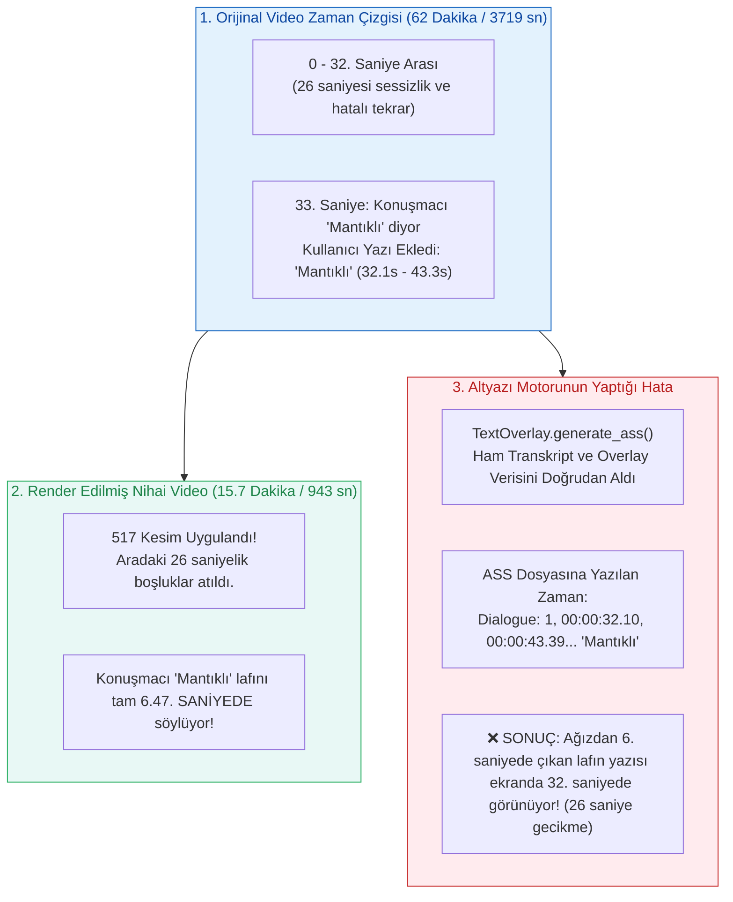

# 🎬 OtoEdit — Altyazı ve Text Overlay Zaman Haritalama (Timeline Remapping) Çözüm Planı

> **Tarih:** 29 Eylül 2026  
> **Konum:** `docs/altyazi_ve_overlay_zaman_haritalama_cozum_plani.md`  
> **Durum:** Aktif Teşhis + Güvenli Çözüm Mimarisi  
> **İlgili Dosyalar:**  
> - [`src/OtoEdit.PythonWorker/render/video_renderer.py`](file:///d:/OtoEdit/OtoEdit/src/OtoEdit.PythonWorker/render/video_renderer.py)  
> - [`src/OtoEdit.PythonWorker/render/text_overlay.py`](file:///d:/OtoEdit/OtoEdit/src/OtoEdit.PythonWorker/render/text_overlay.py)  

---

## 1. Genel Durum ve Başarı Özeti

OtoEdit render motorunda yapılan son optimizasyonlarla sistemin omurgası kusursuz çalışır hale getirilmiştir:
1. **Render Süresi:** 1 saatlik video montajı **~90 dakikadan ~11 dakikaya** indirilmiştir (8 thread paralel kesim + NVENC GPU birleştirme).
2. **Video Donma Hatası (Freeze):** 16. dakikadan sonraki 46 dakikalık donuk son kare hatası tamamen giderilmiş; video tam **15 dakika 43 saniyede (943.5 sn)** temiz bir şekilde sonlanmaktadır.
3. **A/V Senkronizasyonu:** Görüntü ve ses arasındaki milisaniyelik kaymalar sıfırlanmıştır (0.000s offset).
4. **Montaj/Kesim Kalitesi:** 105 hatalı tekrar (retake) ve sessizlikler videodan başarıyla budanmıştır.

### ⚠️ Geriye Kalan Tek Sorun:
Videonun konuşmaları ve kesimleri doğru olmasına rağmen:
- **Altyazılar (Whisper transkripti) saniye olarak kaymaktadır** (konuşulan sözcük ile ekrandaki yazı uyuşmamaktadır).
- **Editörden eklenen metinler (Örn: *"Mantıklı"* yazısı) yanlış saniyede gelmektedir.**

---

## 2. Sorunun Kök Neden Analizi (Root Cause Analysis)

Bu sorun video kesim motorundan değil, **İki Farklı Zaman Çizgisinin (Timeline) Birbirine Dönüştürülmemesinden** kaynaklanmaktadır.



### Somut Kanıt (Log ve ASS Dosyası İncelemesi):
Son yapılan render'ın `cuts.txt` ve `subtitles.ass` dosyaları karşılaştırıldığında:
1. `cuts.txt` ilk saniyeleri:
   - 0.0s - 0.1s (0.1s korundu)
   - *[0.1s - 3.2s arası KESİLDİ - 3.1s kayıp]*
   - 3.2s - 4.23s (1.03s korundu)
   - *[4.23s - 8.73s arası KESİLDİ - 4.5s kayıp]*
   - 8.73s - 10.08s (1.35s korundu)
   - *[10.08s - 28.28s arası KESİLDİ - 18.2s kayıp]*
   - 28.28s - 32.27s (3.99s korundu)
2. **Toplam Korunan Video:** Orijinal videonun 32.27. saniyesine gelindiğinde, nihai videoda **yalnızca 6.47 saniye** geçmiştir!
3. Kullanıcının koyduğu *"Mantıklı"* yazısı ASS dosyasına şöyle basılmıştır:
   ```text
   Dialogue: 1,0:00:32.10,0:00:43.39,Default,,0,0,0,,{\pos(966,615)...}Mantıklı
   ```
4. **Sonuç:** Kullanıcı videoda o lafı 6. saniyede duymakta, ancak yazı 32. saniyede ekrana gelmektedir. Dakikalar ilerledikçe kesilen süreler biriktiği için (toplam 46 dakika kesilmiştir), 20. dakikadan sonraki konuşmaların altyazısı hiç görünmemektedir (çünkü video 15.7 dakikada bitmektedir).

---

## 3. Çalışan Sistemi Kesinlikle Bozmadan Çözüm Prensibi

Aşağıdaki bileşenler şu an **mükemmel** çalıştığı için bunlara **ASLA DOKUNULMAYACAKTIR**:
- ❌ FFmpeg paralel kesim motoruna dokunulmayacak.
- ❌ Concat demuxer ve `_execute_ffmpeg_with_concat` mantığına dokunulmayacak.
- ❌ NVENC GPU ayarlarına, ses resample parametrelerine dokunulmayacak.
- ❌ faster-whisper GPU ve akıllı retake algoritmalarına dokunulmayacak.

### Tek Müdahale Noktası:
Yalnızca `TextOverlay.generate_ass(...)` çağrılmadan hemen önce, **zaman damgaları yeni videoya göre yeniden hesaplanacak (Time Remapping)**.

---

## 4. Zaman Haritalama (Timeline Remapping) Matematiksel Modeli

Elimizde korunan aralıkların listesi vardır:  
`keep_segments = [(k_start_0, k_end_0), (k_start_1, k_end_1), ..., (k_start_n, k_end_n)]`

Her segmentin nihai videodaki kümülatif başlama zamanı:
$$\text{out\_start}_i = \sum_{j=0}^{i-1} (k\_end_j - k\_start_j)$$

Orijinal videodaki herhangi bir $T_{\text{orig}}$ zaman noktasının yeni videodaki karşılığı $T_{\text{new}}$:
1. **Durum A (Korunan bölgede):** Eğer $k\_start_i \le T_{\text{orig}} \le k\_end_i$ ise:
   $$T_{\text{new}} = \text{out\_start}_i + (T_{\text{orig}} - k\_start_i)$$
2. **Durum B (Kesilen bölgede):** Eğer $T_{\text{orig}}$ iki korunan aralığın arasında (silinmiş sessizlik veya silinmiş retake içinde) kalmışsa:
   Bu konuşma veya yazı **kesilen bölgeye aittir; yeni videoda yeri yoktur, elenir (None).**

---

## 5. Uygulama Adımları (Kod Mimarisi)

### Adım 5.1: `TimelineMapper` Yardımcı Modülünün Eklenmesi
`src/OtoEdit.PythonWorker/render/timeline_mapper.py` adında saf matematiksel ve yan etkisiz (pure function) bir modül oluşturulacaktır.

Bu modül 3 görevi yerine getirir:
1. `remap_timestamp(t, keep_segments)`: Tek bir zaman noktasını dönüştürür.
2. `remap_transcript(transcript, keep_segments)`:
   - Cümlelerin `start` ve `end` sürelerini yeni zamana dönüştürür.
   - Kelime seviyesindeki (`words`) karaoke zamanlarını (`w["start"]`, `w["end"]`) yeni zamana uyarlar.
   - Tamamen kesilen bölgelerde kalan segmentleri listeden çıkarır.
3. `remap_overlays(overlays, keep_segments)`:
   - Kullanıcının koyduğu text overlay'lerin `timestamp` ve `duration` değerlerini kesilmiş videodaki doğru sahneye taşır.

### Adım 5.2: `video_renderer.py` Entegrasyonu
[`video_renderer.py`](file:///d:/OtoEdit/OtoEdit/src/OtoEdit.PythonWorker/render/video_renderer.py) içindeki `render` fonksiyonunda altyazı üretimi öncesine haritalama eklenir:

```python
# video_renderer.py içindeki render metodu:

# 1. Korunan aralıklar hesaplandıktan sonra:
keep_segments = self._get_keep_segments(cuts, total_duration) if cuts and total_duration > 0 else []

# 2. Transkript ve Overlay'leri kesilmiş videonun zaman çizgisine uyarla:
if keep_segments and len(keep_segments) > 0:
    mapped_transcript = TimelineMapper.remap_transcript(transcript, keep_segments)
    mapped_overlays = TimelineMapper.remap_overlays(text_overlays, keep_segments)
else:
    mapped_transcript = transcript
    mapped_overlays = text_overlays

# 3. ASS dosyasını artık haritalanmış doğru zamanlarla üret:
if mapped_overlays or mapped_transcript:
    candidate_ass = os.path.join(temp_dir, f"subtitles_{os.path.basename(output_path)}.ass")
    TextOverlay.generate_ass(
        overlays=mapped_overlays,
        transcript=mapped_transcript,
        output_path=candidate_ass
    )
```

---

## 6. Beklenen Nihai Çıktı ve Doğrulama Kriterleri

| Özellik | Şu Anki Durum | Haritalama Sonrası |
|---|---|---|
| **Altyazı Başlangıcı** | Orijinal 33. sn konuşması 33. sn'de görünüyor (26 sn geç) | ✅ Konuşmacı lafa başladığı anda (6.47. sn) ekranda yanar |
| **Kullanıcı Yazısı ("Mantıklı")** | 32.10 - 43.39 sn arasında boş sahnede çıkıyor | ✅ Kullanıcının hedeflediği tam o sahnede (6.3 - 10.5 sn) görünür |
| **Kelime Karaoke Senkronu** | Ses ile karaoke ışığı uyuşmuyor | ✅ Ağızdan çıkan her heceyle birlikte sarı/mavi karaoke ışığı parlar |
| **Kesilen Bölge Altyazıları** | Bazen kesilen konuşmanın kırpıntıları görünebiliyor | ✅ Kesilen 105 tekrarın altyazısı otomatik temizlenir |
| **Render Hızı ve Donma** | 11 dakika, donma yok | ✅ 11 dakika, donma yok (Performans ve stabilite aynen korunur) |

---

## 7. Test ve Onay Planı

1. `TimelineMapper` için izole birim testi (`tests/test_timeline_mapper.py`) yazılacak.
2. Örnek kesimlerle cümlenin ve kelimelerin tam milisaniyesine oturduğu matematiksel olarak kanıtlanacak.
3. `otoedit-dev-worker` içinde `test_pipeline_isolated.py` test paketi tekrar koşturulacak.
4. Gerçek video render edilerek *"Mantıklı"* yazısının ve cümlenin sesle birebir oturduğu gözlemlenecek.
