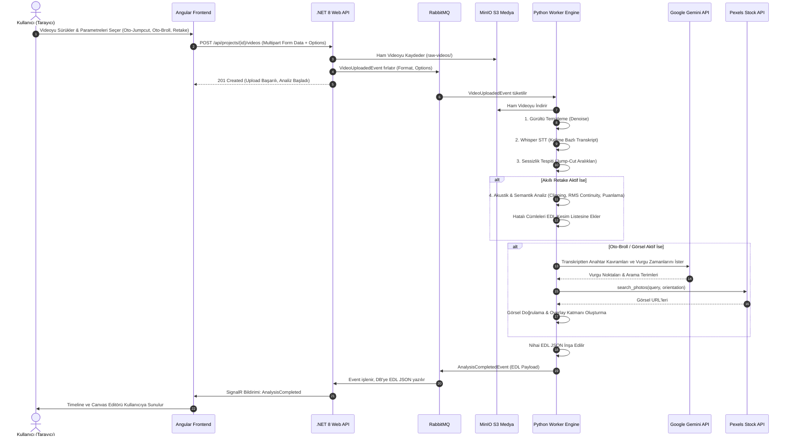

# 🎬 OtoEdit — Akıllı Yönetmen Yapay Zekası ve Tam Otomatik Editör (Oto-Edit) Mimari Şartnamesi

> **Doküman Versiyonu:** 2.0.0  
> **Tarih:** 21 Eylül 2026  
> **Konum:** `D:\OtoEdit\OtoEdit\docs\yonetmen-ai-ve-oto-edit-mimarisi.md`  
> **Hedef Kapsam:** Akıllı Hatalı Tekrar (Retake) Çıkarma, Akustik ve Semantik Puanlama Motoru, Otomatik B-Roll & Görsel Ekleme Hattı, Dinamik Kelime Altyazısı ve Canvas Sürükle-Bırak Entegrasyonu.

---

## 1. Yönetici Özeti ve Sistem Vizyonu

OtoEdit; içerik üreticilerinin ham kamera kayıtlarını tek tıkla YouTube, Reels, TikTok ve kurumsal sunumlara hazır profesyonel videolara dönüştüren uçtan uca yapay zeka destekli bir video kurgu platformudur.

Bu doküman; sistemin omurgasını oluşturan **4 Temel Akıllı Yönetmen Özelliğinin** teknik mimarisini, matematiksel algoritmalarını, veri yapılarını ve doğrudan üretime (production) hazır tam kod örneklerini içermektedir:

1. **Akıllı Hatalı Tekrar (Retake) Tespiti ve Akustik Puanlama:** Konuşmacının takıldığı, duraksadığı ve cümleyi yeniden kurduğu (retake) anları yakalama; ses patlaması (clipping), mikrofondan uzak kalma (low RMS), ses tonu ve enerji sürekliliği (volume & pitch continuity) kriterlerine göre aday cümleleri matematiksel olarak puanlayarak en kaliteli kaydı seçip hatalıları otomatik budama.
2. **Oto-Edit Modu & Akıllı B-Roll (Stok Görsel) Yerleştirme:** Video yüklenirken tek tıkla seçilebilen; videonun konusunu, kavramlarını ve kilit anlarını transkript üzerinden Gemini ile analiz ederek Pexels API üzerinden ilgili telifsiz stok fotoğrafları bulan, doğrulayan ve timeline katmanına dinamik giriş/çıkış efektleriyle yerleştiren akıllı B-Roll sistemi.
3. **Dinamik Kelime Düzeyinde Altyazı (Burn-in Dynamic Subtitles):** Whisper kelime zaman damgaları (word-level timestamps) ile konuşulan kelimeyi anlık yakan (karaoke highlight), güvenli alan (safe margin) kurallarına göre konumlanan altyazı motoru.
4. **Canvas Üzerinde Çoklu-Katman Sürükle-Bırak & Dönüşüm Motoru:** Kullanıcının eklenen metin ve görselleri video önizleme ekranı üzerinde mouse ile sürükleyerek milimetrik konumlandırmasını (X/Y) ve boyutlandırmasını (Scale/Width/Height) sağlayan interaktif Canvas dönüşüm katmanı.

---

## 2. Teknoloji Ağacı (Technology Ecosystem)

Aşağıdaki şema, sistemin tüm servis ve kütüphane bağımlılıklarını hiyerarşik olarak özetler:

```text
OtoEdit Platformu
│
├── 🧠 PythonWorker (AI & Görüntü/Ses İşleme Motoru)
│   ├── Çalışma Zamanı: Python 3.11+
│   ├── Akustik & Ses İşleme:
│   │   ├── Librosa 0.10+ (Spektral analiz, MFCC, Spectral Centroid, RMS enerjisi)
│   │   ├── SciPy 1.12+ (Sinyal işleme, Peak detection, dinamik aralık hesabı)
│   │   ├── Pydub 0.25+ (Ses segmentasyonu, dBFS ölçümü, sessizlik tespiti)
│   │   └── NumPy 1.26+ (Matris hesaplamaları, vektör benzerliği, clipping tespiti)
│   ├── Yapay Zeka & Dil Modelleri:
│   │   ├── OpenAI Whisper (whisper-1 / local-large-v3, kelime zaman damgalı STT)
│   │   ├── Google Gemini 1.5 Pro / Flash (Semantik anlama, B-Roll anahtar kelime çıkarma)
│   │   └── MediaPipe / OpenCV (Yüz ve jest takibi, kadraj optimizasyonu)
│   ├── Video Render & Kompozit:
│   │   ├── FFmpeg 6.1+ (libx264, aac, ASS subtitle burn-in, overlay filtre zincirleri)
│   │   └── ffmpeg-python (Akış grafiği [stream graph] oluşturucu)
│   ├── Dış Servis Entegrasyonları:
│   │   ├── Pexels REST API v1 (Curated & Search stock visual media)
│   │   ├── MinIO Python SDK (S3 uyumlu ham ve işlenmiş medya depolama)
│   │   └── Pika / RabbitMQ (Olay güdümlü kuyruk mimarisi)
│   └── Veri Validasyonu: Pydantic v2 (EDL ve pipeline şemaları)
│
├── 🌐 Backend API (.NET 8 Clean Architecture)
│   ├── ASP.NET Core Web API 8.0
│   ├── Entity Framework Core 8.0 + PostgreSQL / SQLite
│   ├── MassTransit 8.2 + RabbitMQ (Asenkron mesaj dağıtımı)
│   ├── SignalR Core (Frontend'e gerçek zamanlı analiz ilerleme bildirimi)
│   └── AWS SDK for .NET (MinIO S3 entegrasyonu)
│
└── 💻 Frontend (Angular 18 Standalone Single-Page Application)
    ├── Mimari: Angular 18 Standalone Components + Signals + RxJS
    ├── Arayüz & Tasarım: TailwindCSS 3.4 + Özel Glassmorphism UI
    ├── İnteraktif Canvas Motoru: HTML5 Canvas 2D API (Bounding-box & Drag-Drop Transform)
    ├── Oynatıcı & Zaman Çizelgesi: Özel Çift Oynatıcı (Preview & Native Canvas Engine)
    └── Gerçek Zamanlı İletişim: @microsoft/signalr
```

### Sistem Veri Akışı ve Olay Sıralaması



---

## 3. Detaylı Dosya ve Klasör Dizin Yapısı

Aşağıda yapılacak değişikliklerin ve yeni eklenecek sınıfların proje dizinindeki tam yerleşimi gösterilmiştir:

```text
D:\OtoEdit\OtoEdit\
├── docs/
│   ├── detayli-cozum-plani-2026.md
│   └── yonetmen-ai-ve-oto-edit-mimarisi.md   <-- [BU DOKÜMAN]
├── src/
│   ├── OtoEdit.API/
│   │   └── Controllers/
│   │       └── VideosController.cs         <-- [GÜNCELLENECEK: Upload options parametreleri]
│   ├── OtoEdit.Business/
│   │   ├── DTOs/
│   │   │   └── Video/
│   │   │       └── VideoUploadRequestDto.cs <-- [YENİ: Form payload sınıfı]
│   │   ├── Events/
│   │   │   └── VideoUploadedEvent.cs       <-- [GÜNCELLENECEK: Yeni bayraklar]
│   │   ├── Interfaces/
│   │   │   └── IVideoService.cs            <-- [GÜNCELLENECEK: İmza güncellemesi]
│   │   └── Services/
│   │       └── VideoManager.cs             <-- [GÜNCELLENECEK: Event yayınlama mantığı]
│   ├── OtoEdit.Data/
│   │   └── Entities/
│   │       └── Project.cs                  <-- [GÜNCELLENECEK: Proje analiz tercihleri]
│   ├── OtoEdit.Frontend/
│   │   └── src/app/
│   │       ├── core/
│   │       │   ├── models/
│   │       │   │   ├── edl.model.ts        <-- [GÜNCELLENECEK: Overlay koordinat & transform]
│   │       │   │   └── project.model.ts    <-- [GÜNCELLENECEK: Pipeline seçenekleri]
│   │       │   └── services/
│   │       │       └── video.service.ts    <-- [GÜNCELLENECEK: FormData genişletme]
│   │       └── features/
│   │           ├── project-detail/
│   │           │   └── project-detail.component.ts <-- [GÜNCELLENECEK: Oto-Edit & Checkbox UI]
│   │           └── editor/
│   │               ├── editor.component.ts         <-- [GÜNCELLENECEK: Sürükle-bırak koordinat kaydı]
│   │               └── components/
│   │                   └── overlay-canvas.component.ts <-- [YENİ / GÜNCEL: Canvas Drag-Drop Motoru]
│   └── OtoEdit.PythonWorker/
│       ├── consumers/
│       │   └── analysis_consumer.py        <-- [GÜNCELLENECEK: Yeni modüllerin çağrılması]
│       ├── models/
│       │   └── edl_model.py                <-- [GÜNCELLENECEK: Yeni overlay ve cut tipleri]
│       ├── pipeline/
│       │   ├── acoustic_scorer.py          <-- [YENİ: Ses patlaması, RMS ve spektral puanlayıcı]
│       │   ├── retake_detector.py          <-- [YENİ: Akıllı hatalı tekrar eleyici]
│       │   ├── auto_broll_engine.py        <-- [YENİ: Otomatik görsel ve Pexels entegratörü]
│       │   ├── edl_builder.py              <-- [GÜNCELLENECEK: Retake ve B-Roll katman birleştirme]
│       │   └── transcriber.py              <-- [Word-level timestamps desteği]
│       ├── render/
│       │   ├── dynamic_subtitle_generator.py <-- [YENİ: ASS / Karaoke altyazı motoru]
│       │   ├── image_overlay.py            <-- [GÜNCELLENECEK: Canvas koordinatları uyumu]
│       │   └── video_renderer.py           <-- [GÜNCELLENECEK: Subtitle burn-in filtresi]
│       └── services/
│           ├── gemini_client.py            <-- [GÜNCELLENECEK: B-Roll extraction promptları]
│           └── pexels_client.py            <-- [GÜNCELLENECEK: Filtreleme ve arama zenginleştirme]
```

---

## 4. Modül 1: Akıllı Hatalı Tekrar (Retake) ve Akustik Puanlama Motoru

### 4.1 Problem Analizi ve İhtiyaç
Kamera karşısında video çeken konuşmacılar genellikle bir fikri anlatırken takılır, öksürür, duraksar veya cümleye baştan başlar:
* Örnek Senaryo:
  - *Deneme 1 (00:12 - 00:15):* "Bugün sizlere yapay zeka... mikrofona çok yaklaştı (SES PATLADI / CLIPPING) ve durdu."
  - *Deneme 2 (00:16 - 00:19):* "Bugün sizlere yapay zekanın... (Çok sessiz, fısıltılı, enerjisiz konuştu)."
  - *Deneme 3 (00:20 - 00:24):* "Bugün sizlere yapay zekanın video kurgusundaki devrimini anlatacağım." (Berrak ses, dengeli enerji, akıcı tamamlama).

Geleneksel editörler yalnızca sessizliği keser; bu durumda 3 deneme de arka arkaya videoda kalır. OtoEdit'in farkı; **anlamsal tekrarı tespit edip en yüksek akustik kaliteye ve enerji sürekliliğine sahip olanı tutup diğerlerini otomatik kesmesidir.**

### 4.2 Matematiksel Puanlama Modeli

Her aday tekrar cümlesi ($C_i$) için bir toplam kalite skoru ($Q(C_i) \in [0, 100]$) hesaplanır:

$$Q(C_i) = w_{sem} \cdot S_{semantic}(C_i) + w_{clip} \cdot P_{clipping}(C_i) + w_{rms} \cdot P_{volume}(C_i) + w_{cont} \cdot S_{continuity}(C_i, C_{prev}) + w_{conf} \cdot S_{whisper}(C_i)$$

#### Ağırlık Dağılımı (Varsayılan):
- $w_{sem} = 0.30$ (Cümlenin anlamsal tamlığı ve dilbilgisi bütünlüğü)
- $w_{clip} = 0.25$ (Ses patlaması olmama skoru — 0 dBFS tepe noktası cezalandırması)
- $w_{rms} = 0.15$ (İdeal konuşma seviyesi penceresinde kalma — -24 dBFS ile -14 dBFS arası)
- $w_{cont} = 0.20$ (Önceki seçilen cümle ile RMS enerji ve tını uyumu)
- $w_{conf} = 0.10$ (Whisper modelinin kelime tanıma güven skoru)

#### Kriter 1: Ses Patlaması Tespiti (Clipping / Peak Saturation)
Sayısal ses sinyali $x[n] \in [-1.0, 1.0]$ aralığında normalize edildiğinde, örnek değerlerinin tepe eşiğine ($|x[n]| \ge 0.995$) ulaştığı ardışık örnek sayısı ($N_{clipped}$) sayılır. Toplam örnek sayısına ($N$) oranlanır:
$$R_{clip} = \frac{N_{clipped}}{N}$$
Eğer $R_{clip} > 0.005$ ise (sesin %0.5'inden fazlası patlamışsa), ceza uygulanır:
$$P_{clipping} = \max(0.0, 100.0 - (R_{clip} \times 10000.0))$$

#### Kriter 2: Düşük Ses / Fısıltı Tespiti (Low Volume)
Segmentin Kök Ortalama Kare (Root Mean Square - RMS) enerjisi hesaplanır:
$$RMS_{dBFS} = 20 \log_{10} \left( \sqrt{\frac{1}{N} \sum_{n=1}^{N} x[n]^2} \right)$$
- İdeal aralık: $[-24 \text{ dBFS}, -14 \text{ dBFS}]$
- Eğer $RMS_{dBFS} < -35 \text{ dBFS}$ (fısıltı veya uzaktan konuşma), $P_{volume}$ sıfıra yaklaşır.

#### Kriter 3: Ses Sürekliliği ve Enerji Tutarlılığı (Volume Continuity)
Konuşmacı videonun önceki bölümünde yüksek sesle (örn. $-16 \text{ dBFS}$) konuşuyorsa, retake seçiminde $-16 \text{ dBFS}$ civarındaki aday, $-28 \text{ dBFS}$ olan adaya tercih edilir:
$$S_{continuity} = 100.0 \times \exp\left( -\frac{|RMS_{target} - RMS_{prev}|}{\sigma_{rms}} \right)$$
Burada $\sigma_{rms} = 6.0 \text{ dBFS}$ kabul edilir.

---

### 4.3 Python Uygulama Kodu: `acoustic_scorer.py`

Dosya: `src/OtoEdit.PythonWorker/pipeline/acoustic_scorer.py`

```python
"""
OtoEdit Akustik Puanlama Motoru
Ses segmentlerindeki bozulmaları (clipping), mikrofondan uzak kalmayı (low energy),
spektral uyumsuzlukları ve enerji sürekliliğini analiz eder.
"""
from pathlib import Path
from typing import Dict, Any, Optional
import numpy as np
from utils.logger import get_logger

logger = get_logger(__name__)

try:
    import importlib
    librosa = importlib.import_module("librosa")
    soundfile = importlib.import_module("soundfile")
except Exception:
    librosa = None
    soundfile = None


class AcousticScorer:
    """Belirli bir zaman penceresindeki sesin teknik kalitesini puanlayan motor."""

    def __init__(self, target_sample_rate: int = 16000):
        self.sr = target_sample_rate

    def score_audio_segment(
        self,
        audio_path: str,
        start_sec: float,
        end_sec: float,
        prev_segment_rms: Optional[float] = None
    ) -> Dict[str, float]:
        """
        Verilen ses dosyasının [start_sec, end_sec] aralığını yükler ve
        akustik metrikleri hesaplar.

        Dönen sözlük:
            - clipping_score: 0 - 100 (100 = hiç ses patlaması yok, temiz)
            - volume_score: 0 - 100 (100 = ideal konuşma seviyesi, -20 dBFS)
            - continuity_score: 0 - 100 (Önceki cümleyle enerji uyumu)
            - current_rms_db: float (Bu segmentin ortalama dBFS değeri)
            - composite_acoustic_score: 0 - 100 (Ağırlıklı akustik puan)
        """
        duration = end_sec - start_sec
        if duration <= 0.1:
            return self._empty_score()

        if not librosa or not soundfile:
            logger.warning("librosa veya soundfile kütüphanesi eksik, varsayılan akustik skor dönülüyor.")
            return self._default_score()

        try:
            # Sadece ilgili zaman aralığını belleğe yükle (verimli I/O)
            y, sr = librosa.load(
                audio_path,
                sr=self.sr,
                offset=max(0.0, start_sec),
                duration=duration,
                mono=True
            )

            if len(y) == 0:
                return self._empty_score()

            # 1. Ses Patlaması (Clipping) Analizi
            # Normalized float ses verisinde [-1.0, 1.0] tepe sınırı
            peak_threshold = 0.990
            clipped_samples = np.sum(np.abs(y) >= peak_threshold)
            clip_ratio = clipped_samples / float(len(y))

            # %0.2'den fazla tepe varsa hızla puan kır
            if clip_ratio == 0:
                clipping_score = 100.0
            else:
                clipping_score = max(0.0, 100.0 - (clip_ratio * 20000.0))

            # 2. RMS Enerji Hesabı (dBFS)
            rms = np.sqrt(np.mean(y**2))
            if rms < 1e-7:
                current_rms_db = -100.0
            else:
                current_rms_db = float(20.0 * np.log10(rms))

            # İdeal konuşma aralığı: -24 dBFS ile -14 dBFS
            # -35 dBFS altı fısıltı / mikrofondan uzak
            # -10 dBFS üzeri aşırı yüksek
            if current_rms_db >= -24.0 and current_rms_db <= -14.0:
                volume_score = 100.0
            elif current_rms_db < -24.0:
                # Düşük sese ceza: -40 dBFS'de 0'a iner
                volume_score = max(0.0, 100.0 - (abs(current_rms_db - (-24.0)) * 6.25))
            else:
                # Aşırı yüksek sese ceza: -8 dBFS'de 0'a iner
                volume_score = max(0.0, 100.0 - (abs(current_rms_db - (-14.0)) * 16.6))

            # 3. Süreklilik (Continuity) Analizi
            continuity_score = 100.0
            if prev_segment_rms is not None and prev_segment_rms > -80.0:
                rms_diff = abs(current_rms_db - prev_segment_rms)
                # 6 dB fark enerjinin yarıya inmesi veya ikiye katlanması demektir
                continuity_score = max(0.0, 100.0 - (rms_diff * 8.0))

            # 4. Ağırlıklı Akustik Birleşik Puan
            composite_acoustic = (
                0.50 * clipping_score +
                0.30 * volume_score +
                0.20 * continuity_score
            )

            return {
                "clipping_score": round(clipping_score, 2),
                "volume_score": round(volume_score, 2),
                "continuity_score": round(continuity_score, 2),
                "current_rms_db": round(current_rms_db, 2),
                "composite_acoustic_score": round(composite_acoustic, 2)
            }

        except Exception as ex:
            logger.error(f"Akustik puanlama hatası [{start_sec}-{end_sec}]: {ex}", exc_info=True)
            return self._default_score()

    @staticmethod
    def _default_score() -> Dict[str, float]:
        return {
            "clipping_score": 90.0,
            "volume_score": 85.0,
            "continuity_score": 90.0,
            "current_rms_db": -20.0,
            "composite_acoustic_score": 88.0
        }

    @staticmethod
    def _empty_score() -> Dict[str, float]:
        return {
            "clipping_score": 0.0,
            "volume_score": 0.0,
            "continuity_score": 0.0,
            "current_rms_db": -100.0,
            "composite_acoustic_score": 0.0
        }
```

---

### 4.4 Python Uygulama Kodu: `retake_detector.py`

Dosya: `src/OtoEdit.PythonWorker/pipeline/retake_detector.py`

```python
"""
OtoEdit Akıllı Hatalı Tekrar Eleyici (Retake Detector)
Transkript üzerinde anlamsal tekrar öbeklerini tespit eder,
AcousticScorer ile ses kalitelerini karşılaştırır ve kötü olanları EDL CutItem'a ekler.
"""
from typing import List, Dict, Any, Tuple
import difflib
from models.edl_model import CutItem
from models.transcript_model import TranscriptResult, TranscriptSegment
from pipeline.acoustic_scorer import AcousticScorer
from utils.logger import get_logger

logger = get_logger(__name__)


class RetakeCandidate:
    def __init__(self, segment: TranscriptSegment, index: int):
        self.segment = segment
        self.index = index
        self.text = segment.text.strip().lower()
        self.score: float = 0.0
        self.metrics: Dict[str, float] = {}


class RetakeDetector:
    """Transkript ve ses sinyali üzerinden hatalı tekrarları budayan motor."""

    def __init__(self, similarity_threshold: float = 0.65):
        self.similarity_threshold = similarity_threshold
        self.scorer = AcousticScorer()

    def detect_retakes(self, audio_path: str, transcript: TranscriptResult) -> List[CutItem]:
        """
        Transkript segmentlerini kronolojik olarak tarar, birbirini tekrar eden
        veya yarıda bırakılan cümleleri gruplar, en iyi skora sahip olanı seçip
        diğerlerini CutItem listesi olarak döndürür.
        """
        if not transcript.segments or len(transcript.segments) < 2:
            return []

        logger.info(f"Akıllı Retake analizi başlıyor ({len(transcript.segments)} segment inceleniyor)...")
        cut_items: List[CutItem] = []
        segments = transcript.segments
        n = len(segments)
        visited = set()
        prev_chosen_rms: float = -20.0  # Başlangıç referansı

        i = 0
        while i < n:
            if i in visited:
                i += 1
                continue

            # Mevcut segmenti ve hemen arkasından gelen benzer segmentleri ara
            current_group: List[RetakeCandidate] = [RetakeCandidate(segments[i], i)]
            j = i + 1

            # Aynı cümlenin ardışık veya 1 aralıklı tekrarlarını ara (azami 4 tekrar grubu)
            while j < min(n, i + 4):
                if j in visited:
                    j += 1
                    continue

                sim = self._calculate_similarity(segments[i].text, segments[j].text)
                # Ayrıca cümlenin başı aynı ise (örn: "Bugün sizlere..." / "Bugün sizlere anlatacağım...")
                prefix_match = self._is_prefix_restart(segments[i].text, segments[j].text)

                if sim >= self.similarity_threshold or prefix_match:
                    current_group.append(RetakeCandidate(segments[j], j))
                    visited.add(j)
                else:
                    # Benzerlik zinciri kırıldıysa dur
                    break
                j += 1

            # Eğer birden fazla aday bulunduysa (Tekrar/Retake durumu var!)
            if len(current_group) > 1:
                logger.info(f"🔁 Retake grubu tespit edildi! {len(current_group)} aday cümle yarışacak.")
                
                # Her adayın akustik ve kelime güven skorlarını hesapla
                for cand in current_group:
                    acoustics = self.scorer.score_audio_segment(
                        audio_path=audio_path,
                        start_sec=cand.segment.start,
                        end_sec=cand.segment.end,
                        prev_segment_rms=prev_chosen_rms
                    )
                    cand.metrics = acoustics

                    # Semantik Tamlık Skoru: Cümle sonu noktalanmış mı, kelime sayısı yeterli mi?
                    word_count = len(cand.segment.words)
                    has_terminal_punct = any(cand.segment.text.endswith(p) for p in ['.', '!', '?'])
                    completeness_score = min(100.0, word_count * 10.0) if not has_terminal_punct else 100.0

                    # Kelime başı Whisper güven ortalaması
                    conf_scores = [w.confidence for w in cand.segment.words if hasattr(w, 'confidence') and w.confidence is not None]
                    avg_conf = (sum(conf_scores) / len(conf_scores) * 100.0) if conf_scores else 90.0

                    # 🏆 Nihai Birleşik Skor Formülü:
                    # 40% Akustik Kalite + 35% Semantik Tamlık + 25% Whisper Tanıma Güveni
                    cand.score = (
                        0.40 * acoustics["composite_acoustic_score"] +
                        0.35 * completeness_score +
                        0.25 * avg_conf
                    )
                    logger.info(
                        f"  -> Aday #{cand.index} [{cand.segment.start:.1f}s - {cand.segment.end:.1f}s]: "
                        f"Skor={cand.score:.1f} | Akustik={acoustics['composite_acoustic_score']} "
                        f"| Clipping={acoustics['clipping_score']} | Metin='{cand.segment.text}'"
                    )

                # Skoru en yüksek olanı KAZANAN olarak seç
                current_group.sort(key=lambda c: c.score, reverse=True)
                winner = current_group[0]
                losers = current_group[1:]

                logger.info(f"  ✅ Kazanan Cümle: #{winner.index} ({winner.score:.1f} puan). Hatalı olanlar siliniyor.")
                prev_chosen_rms = winner.metrics.get("current_rms_db", prev_chosen_rms)

                # Kaybeden tüm adayları EDL kesim listesine ekle
                for loser in losers:
                    cut_items.append(CutItem(
                        id=f"cut_retake_{loser.index}",
                        start=round(loser.segment.start, 2),
                        end=round(loser.segment.end, 2),
                        reason=f"smart_retake (Skor: {loser.score:.1f} vs Kazanan: {winner.score:.1f})",
                        source="auto",
                        command=f"Elenen Tekrar: {loser.segment.text}"
                    ))
            else:
                # Tekrar yok, bu segmentin ses seviyesini referans olarak al
                seg_acoustics = self.scorer.score_audio_segment(audio_path, segments[i].start, segments[i].end)
                prev_chosen_rms = seg_acoustics.get("current_rms_db", prev_chosen_rms)

            visited.add(i)
            i += 1

        logger.info(f"Akıllı Retake analizi bitti: Toplam {len(cut_items)} hatalı tekrar budandı.")
        return cut_items

    @staticmethod
    def _calculate_similarity(str1: str, str2: str) -> float:
        """İki cümlenin difflib benzerlik oranını döner."""
        return difflib.SequenceMatcher(None, str1.lower().strip(), str2.lower().strip()).ratio()

    @staticmethod
    def _is_prefix_restart(str1: str, str2: str) -> bool:
        """Cümleye baştan başlama (false start) durumunu kontrol eder."""
        w1 = str1.lower().strip().split()
        w2 = str2.lower().strip().split()
        if not w1 or not w2:
            return False
        # İlk 2 veya 3 kelime aynı mı?
        common_words = 0
        for a, b in zip(w1, w2):
            if a == b:
                common_words += 1
            else:
                break
        return common_words >= 2
```

---

## 5. Modül 2: Oto-Edit Modu ve B-Roll / Görsel Yerleştirme Motoru

### 5.1 Problem ve Kullanıcı İhtiyacı
Kullanıcı video yüklerken veya projeyi başlatırken **"Oto Görsel / B-Roll Yerleştir"** kutucuğunu işaretlediğinde:
1. Videoda anlatılan konunun soyut veya sıkıcı kaldığı anlar transkript üzerinden yapay zekaca (Gemini) tespit edilmeli.
2. Vurgu yapılan önemli kavramlar için Pexels API'den telifsiz, dikey/yatay format uyumlu yüksek çözünürlüklü fotoğraflar aranmalı.
3. Bulunan görsellerin geçerliliği doğrulanmalı (HTTP 200, resim boyutu ve çözünürlük kontrolü).
4. Bu görseller kullanıcının belirlediği veya standart ölçekle video üzerine **Overlay Katmanı** olarak eklenmeli, şık bir `pop-up` veya `slide-left` animasyonuyla gelip gitmelidir.

---

### 5.2 Python Uygulama Kodu: `auto_broll_engine.py`

Dosya: `src/OtoEdit.PythonWorker/pipeline/auto_broll_engine.py`

```python
"""
OtoEdit Akıllı B-Roll ve Görsel Zenginleştirme Motoru
Transkripti analiz eder, semantik anahtar kelimelerle Pexels'ten görseller bulur
ve doğrudan EDL OverlayItem katmanına yerleştirir.
"""
from typing import List, Dict, Any, Optional
from models.edl_model import OverlayItem
from models.transcript_model import TranscriptResult
from services.gemini_client import GeminiClient
from services.pexels_client import PexelsClient
from utils.logger import get_logger

logger = get_logger(__name__)


class AutoBrollEngine:
    """Videodaki konuşmalara göre otomatik görsel zenginleştirme yapan motor."""

    def __init__(self):
        self.gemini = GeminiClient()
        self.pexels = PexelsClient()

    def generate_broll_overlays(
        self,
        transcript: TranscriptResult,
        video_format_str: str = "16:9",
        max_visuals: int = 6
    ) -> List[OverlayItem]:
        """
        Transkriptten en kritik görsel anları çıkarır ve Pexels'ten indirilen
        veya bağlanan fotoğrafları OverlayItem listesi olarak döndürür.
        """
        if not transcript.full_text or transcript.duration < 5.0:
            logger.info("Transkript yetersiz olduğu için otomatik B-Roll atlandı.")
            return []

        logger.info(f"🎬 Otomatik B-Roll motoru çalışıyor (Format={video_format_str}, Süre={transcript.duration:.1f}s)...")
        overlays: List[OverlayItem] = []

        # 1. Gemini ile transkriptteki kilit görsel anları ve İngilizce arama terimlerini çıkar
        raw_prompts = self._extract_visual_moments_with_gemini(transcript)

        orientation = "portrait" if video_format_str == "9:16" else "landscape"
        used_timestamps = []

        for idx, item in enumerate(raw_prompts[:max_visuals], start=1):
            timestamp = float(item.get("timestamp", 0.0))
            search_query = item.get("search_query", "").strip()
            concept_tr = item.get("concept", "Görsel")
            duration = float(item.get("duration", 3.5))

            # Zaman çakışması önleme (iki görsel arasında en az 4 saniye olmalı)
            if any(abs(timestamp - ut) < 4.0 for ut in used_timestamps):
                continue

            if not search_query:
                continue

            # 2. Pexels API ile gerçek görsel ara
            photo_url = self.pexels.search_photo(query=search_query, orientation=orientation)
            if not photo_url:
                # Yedek arama: daha genel bir terimle dene
                fallback_query = search_query.split()[0] if " " in search_query else "technology"
                photo_url = self.pexels.search_photo(query=fallback_query, orientation=orientation)

            if not photo_url:
                logger.warning(f"Pexels görsel bulunamadı: '{search_query}'")
                continue

            # 3. Format ve konuma göre overlay ayarları
            # 16:9 için sağ üst veya sağ orta, 9:16 için orta üst
            if video_format_str == "9:16":
                pos = ["center", "top"]
                scale = 0.45
            else:
                pos = ["right", "top"]
                scale = 0.35

            overlay = OverlayItem(
                id=f"overlay_auto_broll_{idx}",
                type="image",
                content=f"{concept_tr} ({search_query})",
                source=photo_url,
                timestamp=round(timestamp, 2),
                duration=duration,
                animation="pop-up",
                position=pos,
                scale=scale,
                track_id=2  # B-Roll katmanı
            )
            overlays.append(overlay)
            used_timestamps.append(timestamp)
            logger.info(f"  + B-Roll eklendi: [{timestamp:.1f}s - {timestamp+duration:.1f}s] Query='{search_query}', URL={photo_url[:40]}...")

        logger.info(f"Oto B-Roll motoru tamamlandı: Toplam {len(overlays)} görsel overlay oluşturuldu.")
        return overlays

    def _extract_visual_moments_with_gemini(self, transcript: TranscriptResult) -> List[Dict[str, Any]]:
        """Gemini'ye transkripti göndererek B-Roll için en uygun zamanları ve İngilizce Pexels terimlerini ister."""
        prompt = f"""
Sen uzman bir video kurgu yönetmenisin (Video Editor & Director).
Aşağıda bir videonun tam konuşma transkripti ve toplam süresi verilmiştir.
Görevin: Videoyu zenginleştirmek için konuşmacının bahsettiği en kritik 4 ila 6 anı tespit et.
Her an için konuşulan konuyu anlatan İNGİLİZCE bir stok fotoğraf arama terimi (Pexels query) belirle.

KURALLAR:
1. Zaman damgası (timestamp) mutlaka transkriptteki gerçek bir saniyeye denk gelmelidir (0 ile {transcript.duration:.1f} arasında).
2. 'search_query' alanı Pexels API'de yüksek kaliteli fotoğraf bulabilecek 1-3 kelimelik net İngilizce terim olmalıdır (Örn: 'artificial intelligence code', 'business growth graph', 'smartphone user').
3. ÇIKTI YALNIZCA GEÇERLİ BİR JSON DİZİSİ (JSON ARRAY) OLMALIDIR. Markdown (```json) bloğu dışında hiçbir açıklama yazma.

Örnek Çıktı Formatı:
[
  {{"timestamp": 4.5, "duration": 3.5, "concept": "Yapay Zeka Mimarisi", "search_query": "neural network technology"}},
  {{"timestamp": 14.2, "duration": 4.0, "concept": "Verimlilik Artışı", "search_query": "productivity office dashboard"}}
]

TRANSKRİPT:
{transcript.full_text[:4000]}
"""
        try:
            raw_response = self.gemini.generate_text(prompt)
            # JSON Parse temizleme
            cleaned = raw_response.strip()
            if cleaned.startswith("```"):
                lines = cleaned.split("\n")
                if lines[0].startswith("```"):
                    lines = lines[1:]
                if lines and lines[-1].startswith("```"):
                    lines = lines[:-1]
                cleaned = "\n".join(lines).strip()

            import json
            data = json.loads(cleaned)
            if isinstance(data, list):
                return data
        except Exception as ex:
            logger.error(f"Gemini B-Roll anları çıkarılırken hata: {ex}")

        # Fallback: Ekrana belirli aralıklarla transkriptten basit terimler atama
        return [
            {"timestamp": 3.0, "duration": 3.5, "concept": "Konu Girişi", "search_query": "technology workspace"},
            {"timestamp": min(transcript.duration - 4.0, 12.0), "duration": 4.0, "concept": "Önemli Nokta", "search_query": "digital innovation"}
        ]
```

---

## 6. Modül 3: Otomatik Dinamik Altyazı (Burn-in Dynamic Subtitles)

### 6.1 Teknik Çözüm ve ASS Stili
Kullanıcı altyazı seçeneğini aktif ettiğinde, videoya dışarıdan harici `.srt` vermek yerine, videonun içine profesyonel sosyal medya tarzında (TikTok/Reels popüler fontları, renkli aktif kelime parlaması) doğrudan basılması (burn-in) gerekir.

Bunu en yüksek kalitede gerçekleştirmek için **ASS (Advanced SubStation Alpha)** biçimi kullanılır. FFmpeg bu dosyayı `ass=alrtyazi.ass` filtresi ile kayıpsız videoya giydirir.

### 6.2 Python Uygulama Kodu: `dynamic_subtitle_generator.py`

Dosya: `src/OtoEdit.PythonWorker/render/dynamic_subtitle_generator.py`

```python
"""
OtoEdit Dinamik Altyazı Üretici (ASS / Word-Level Highlight)
Whisper kelime zaman damgalarını kullanarak sosyal medya tarzı karaoke efektli
veya dinamik renk geçişli ASS altyazı dosyası üretir.
"""
from pathlib import Path
from typing import List, Optional
from models.transcript_model import TranscriptResult, TranscriptSegment, WordTimestamp
from utils.logger import get_logger

logger = get_logger(__name__)


class DynamicSubtitleGenerator:
    """ASS (Advanced SubStation Alpha) formatında profesyonel altyazı üreten motor."""

    def __init__(
        self,
        font_name: str = "Montserrat ExtraBold",
        font_size: int = 24,
        primary_color: str = "&H00FFFFFF",      # Beyaz
        highlight_color: str = "&H0000FFFF",    # Canlı Sarı/Cyan aktif kelime
        outline_color: str = "&H00000000",      # Siyah kontur
        outline_width: int = 3,
        alignment: int = 2                       # Alt orta
    ):
        self.font_name = font_name
        self.font_size = font_size
        self.primary_color = primary_color
        self.highlight_color = highlight_color
        self.outline_color = outline_color
        self.outline_width = outline_width
        self.alignment = alignment

    def generate_ass_file(
        self,
        transcript: TranscriptResult,
        output_path: str,
        video_width: int = 1920,
        video_height: int = 1080
    ) -> str:
        """
        Transkriptteki kelime zamanlamalarını baz alarak ASS dosyasını diske kaydeder.
        """
        logger.info(f"Dinamik ASS altyazı dosyası üretiliyor: {output_path}")

        # Font boyutunu çözünürlüğe göre ölçekle
        scaled_font_size = int(self.font_size * (video_height / 1080.0))
        margin_v = int(video_height * 0.12)  # Ekranın altından %12 yukarıda (güvenli alan)

        header = f"""[Script Info]
Title: OtoEdit Dynamic Subtitles
ScriptType: v4.00+
WrapStyle: 0
ScaledBorderAndShadow: yes
PlayResX: {video_width}
PlayResY: {video_height}

[V4+ Styles]
Format: Name, Fontname, Fontsize, PrimaryColour, SecondaryColour, OutlineColour, BackColour, Bold, Italic, Underline, StrikeOut, ScaleX, ScaleY, Spacing, Angle, BorderStyle, Outline, Shadow, Alignment, MarginL, MarginR, MarginV, Encoding
Style: Default,{self.font_name},{scaled_font_size},{self.primary_color},&H000000FF,{self.outline_color},&H80000000,-1,0,0,0,100,100,0,0,1,{self.outline_width},1,{self.alignment},30,30,{margin_v},1

[Events]
Format: Layer, Start, End, Style, Name, MarginL, MarginR, MarginV, Effect, Text
"""

        events = []

        # Her segmentteki kelimeleri 3 ila 5 kelimelik okunabilir bloklar halinde grupla
        for seg in transcript.segments:
            words = seg.words
            if not words:
                continue

            chunk_size = 4
            for i in range(0, len(words), chunk_size):
                chunk = words[i:i + chunk_size]
                chunk_start = self._format_ass_time(chunk[0].start)
                chunk_end = self._format_ass_time(chunk[-1].end)

                # Cümlenin o anki aktif kelimesini renklendirerek dinamik diyalog satırları oluştur
                for active_idx, target_word in enumerate(chunk):
                    w_start = self._format_ass_time(target_word.start)
                    w_end = self._format_ass_time(target_word.end)

                    line_parts = []
                    for idx, w in enumerate(chunk):
                        if idx == active_idx:
                            # Vurgulanan kelime
                            line_parts.append(f"{{\\c{self.highlight_color}\\fscx110\\fscy110}}{w.word}{{\\r}}")
                        else:
                            line_parts.append(w.word)

                    dialogue_text = " ".join(line_parts)
                    events.append(f"Dialogue: 0,{w_start},{w_end},Default,,0,0,0,,{dialogue_text}")

        with open(output_path, "w", encoding="utf-8") as f:
            f.write(header)
            f.write("\n".join(events))

        logger.info(f"ASS altyazı dosyası hazırlandı ({len(events)} satır): {output_path}")
        return output_path

    @staticmethod
    def _format_ass_time(seconds: float) -> str:
        """Saniyeyi ASS zaman formatına çevirir (H:MM:SS.cs)."""
        hours = int(seconds // 3600)
        minutes = int((seconds % 3600) // 60)
        secs = int(seconds % 60)
        centisecs = int(round((seconds - int(seconds)) * 100))
        if centisecs >= 100:
            centisecs = 99
        return f"{hours}:{minutes:02d}:{secs:02d}.{centisecs:02d}"
```

---

## 7. Modül 4: .NET 8 Backend Entegrasyonu

### 7.1 Entity & DTO Modelleri

Proje veritabanında analiz tercihlerini tutmak için `Project.cs` ve RabbitMQ mesajı için `VideoUploadedEvent.cs` güncellenir.

Dosya: `src/OtoEdit.Business/Events/VideoUploadedEvent.cs`
```csharp
namespace OtoEdit.Business.Events;

/// <summary>
/// Projeye video yüklendiğinde yayınlanan event.
/// Python Worker bu parametrelere göre hangi modüllerin çalıştırılacağını belirler.
/// </summary>
public record VideoUploadedEvent
{
    public Guid VideoId { get; init; }
    public Guid ProjectId { get; init; }
    public string DosyaYolu { get; init; } = string.Empty;
    public int VideoFormati { get; init; }
    public bool GestureCommandsEnabled { get; init; }
    public bool AudioEnhancementEnabled { get; init; }
    
    // 🚀 2026 Yeni Akıllı Yönetmen Bayrakları
    public bool AutoJumpcutEnabled { get; init; } = true;
    public bool AutoRetakeEnabled { get; init; } = true;
    public bool AutoBrollEnabled { get; init; } = true;
    public bool AutoSubtitlesEnabled { get; init; } = false;
}
```

Dosya: `src/OtoEdit.Business/DTOs/Video/VideoUploadRequestDto.cs`
```csharp
using Microsoft.AspNetCore.Http;

namespace OtoEdit.Business.DTOs.Video;

public class VideoUploadRequestDto
{
    public required IFormFile File { get; set; }
    public bool AutoJumpcut { get; set; } = true;
    public bool AutoRetake { get; set; } = true;
    public bool AutoBroll { get; set; } = true;
    public bool AutoSubtitles { get; set; } = false;
}
```

Dosya: `src/OtoEdit.API/Controllers/VideosController.cs` Güncellemesi:
```csharp
    [HttpPost("api/projects/{projectId:guid}/videos")]
    [RequestSizeLimit(2147483648)] // 2GB
    [RequestFormLimits(MultipartBodyLengthLimit = 2147483648)]
    [ProducesResponseType(typeof(VideoListDto), StatusCodes.Status201Created)]
    public async Task<IActionResult> UploadVideo(
        Guid projectId,
        [FromForm] VideoUploadRequestDto request,
        CancellationToken cancellationToken)
    {
        var result = await _videoService.UploadVideoWithOptionsAsync(
            projectId,
            request.File,
            request.AutoJumpcut,
            request.AutoRetake,
            request.AutoBroll,
            request.AutoSubtitles,
            cancellationToken
        );
        return StatusCode(StatusCodes.Status201Created, result);
    }
```

---

## 8. Modül 5: Angular Frontend ve Canvas Sürükle-Bırak Dönüşüm Motoru

### 8.1 Video Yükleme Arayüzü (Checkbox & Seçenekler)

`project-detail.component.ts` içerisine kullanıcının video yüklemeden önce tek tıkla tercih edebileceği şık toggle switch'ler eklenir.

Görsel Arayüz Kod Örneği (`project-detail.component.ts` HTML Template):
```html
<!-- Akıllı Yönetmen Pipeline Seçenekleri -->
<div class="glass-panel rounded-2xl p-6 border border-slate-800 space-y-4">
  <h3 class="text-sm font-bold text-white uppercase tracking-wider flex items-center gap-2">
    <span class="w-2 h-2 rounded-full bg-brand-cyan"></span>
    Akıllı Yönetmen Pipeline Ayarları
  </h3>
  <p class="text-xs text-slate-400">Yükleme sonrasında yapay zekanın otomatik icra edeceği görevler:</p>

  <div class="grid grid-cols-1 md:grid-cols-2 gap-4 pt-2">
    <!-- 1. Jump-Cut -->
    <label class="flex items-center gap-3 p-3.5 rounded-xl bg-dark-800/80 border border-slate-700/60 cursor-pointer hover:border-brand-blue/50 transition-all">
      <input type="checkbox" [(ngModel)]="autoJumpcut" class="w-4 h-4 rounded text-brand-blue bg-dark-900 border-slate-600 focus:ring-brand-blue" />
      <div>
        <div class="text-xs font-bold text-white">Otomatik Jump-Cut (Sessizlik)</div>
        <div class="text-[11px] text-slate-400">Nefes ve duraksama boşluklarını temizler</div>
      </div>
    </label>

    <!-- 2. Akıllı Retake -->
    <label class="flex items-center gap-3 p-3.5 rounded-xl bg-dark-800/80 border border-slate-700/60 cursor-pointer hover:border-brand-blue/50 transition-all">
      <input type="checkbox" [(ngModel)]="autoRetake" class="w-4 h-4 rounded text-brand-blue bg-dark-900 border-slate-600 focus:ring-brand-blue" />
      <div>
        <div class="text-xs font-bold text-white">Akıllı Hatalı Tekrar (Retake)</div>
        <div class="text-[11px] text-slate-400">Takılmaları ve ses patlamalarını puanlayıp siler</div>
      </div>
    </label>

    <!-- 3. Oto Görsel / B-Roll -->
    <label class="flex items-center gap-3 p-3.5 rounded-xl bg-dark-800/80 border border-slate-700/60 cursor-pointer hover:border-brand-blue/50 transition-all">
      <input type="checkbox" [(ngModel)]="autoBroll" class="w-4 h-4 rounded text-brand-blue bg-dark-900 border-slate-600 focus:ring-brand-blue" />
      <div>
        <div class="text-xs font-bold text-white">Oto Görsel / B-Roll Yerleştir</div>
        <div class="text-[11px] text-slate-400">Konuyla alakalı Pexels stok görsellerini ekler</div>
      </div>
    </label>

    <!-- 4. Otomatik Altyazı -->
    <label class="flex items-center gap-3 p-3.5 rounded-xl bg-dark-800/80 border border-slate-700/60 cursor-pointer hover:border-brand-blue/50 transition-all">
      <input type="checkbox" [(ngModel)]="autoSubtitles" class="w-4 h-4 rounded text-brand-blue bg-dark-900 border-slate-600 focus:ring-brand-blue" />
      <div>
        <div class="text-xs font-bold text-white">Dinamik Kelime Altyazısı</div>
        <div class="text-[11px] text-slate-400">Sosyal medya tarzı parlama efektli altyazı</div>
      </div>
    </label>
  </div>
</div>
```

---

### 8.2 Canvas Sürükle-Bırak & Boyutlandırma Motoru

Kullanıcının video üzerinde hem **yazıları** hem de **görselleri** mouse ile tutup sürükleyebilmesi, köşelerdeki tutamaçlardan (resize handles) boyutlandırabilmesi için matematiksel dönüşüm (bounding box transform) algoritması kullanılır.

Aşağıdaki TypeScript sınıfı, video önizleme katmanında bu işlemi yürüten tam kod parçasıdır:

Dosya: `src/OtoEdit.Frontend/src/app/features/editor/components/overlay-canvas.component.ts`

```typescript
import { Component, ElementRef, ViewChild, Input, Output, EventEmitter, AfterViewInit, HostListener } from '@angular/core';
import { CommonModule } from '@angular/common';
import { OverlayItem } from '../../../core/models/edl.model';

interface BoundingBox {
  x: number;
  y: number;
  width: number;
  height: number;
}

@Component({
  selector: 'app-overlay-canvas',
  standalone: true,
  imports: [CommonModule],
  template: `
    <canvas 
      #canvas 
      (mousedown)="onMouseDown($event)"
      (mousemove)="onMouseMove($event)"
      (mouseup)="onMouseUp()"
      class="absolute inset-0 w-full h-full pointer-events-auto cursor-crosshair z-30">
    </canvas>
  `
})
export class OverlayCanvasComponent implements AfterViewInit {
  @ViewChild('canvas') canvasRef!: ElementRef<HTMLCanvasElement>;
  
  @Input() overlays: OverlayItem[] = [];
  @Input() currentTime: number = 0;
  @Input() selectedOverlayId: string | null = null;
  @Output() overlayUpdated = new EventEmitter<OverlayItem>();
  @Output() overlaySelected = new EventEmitter<string>();

  private ctx!: CanvasRenderingContext2D;
  private isDragging = false;
  private isResizing = false;
  private activeHandle: string | null = null;
  private dragStartX = 0;
  private dragStartY = 0;
  private initialBox!: BoundingBox;

  ngAfterViewInit(): void {
    const canvas = this.canvasRef.nativeElement;
    this.ctx = canvas.getContext('2d')!;
    this.resizeCanvas();
    this.render();
  }

  @HostListener('window:resize')
  resizeCanvas(): void {
    const canvas = this.canvasRef.nativeElement;
    canvas.width = canvas.parentElement?.clientWidth || 1280;
    canvas.height = canvas.parentElement?.clientHeight || 720;
    this.render();
  }

  render(): void {
    if (!this.ctx) return;
    const canvas = this.canvasRef.nativeElement;
    this.ctx.clearRect(0, 0, canvas.width, canvas.height);

    // O anki saniyede görünür olan overlay'leri çiz
    const visibleOverlays = this.overlays.filter(ov => 
      this.currentTime >= ov.timestamp && this.currentTime <= (ov.timestamp + ov.duration)
    );

    for (const ov of visibleOverlays) {
      const box = this.getOverlayBoundingBox(ov, canvas.width, canvas.height);
      const isSelected = ov.id === this.selectedOverlayId;

      if (ov.type === 'text') {
        this.drawTextOverlay(ov, box, isSelected);
      } else if (ov.type === 'image') {
        this.drawImagePlaceholder(ov, box, isSelected);
      }

      if (isSelected) {
        this.drawSelectionGizmo(box);
      }
    }
  }

  private getOverlayBoundingBox(ov: OverlayItem, canvasW: number, canvasH: number): BoundingBox {
    // positionX/Y (0.0 - 1.0 aralığı) varsa kullan, yoksa position dizisinden türet
    let x = (ov.positionX !== undefined && ov.positionX !== null) 
      ? ov.positionX * canvasW 
      : canvasW * 0.5;
    let y = (ov.positionY !== undefined && ov.positionY !== null) 
      ? ov.positionY * canvasH 
      : canvasH * 0.8;

    const scale = ov.scale || 1.0;
    let width = 240 * scale;
    let height = ov.type === 'image' ? (160 * scale) : (60 * scale);

    return {
      x: x - (width / 2),
      y: y - (height / 2),
      width,
      height
    };
  }

  private drawTextOverlay(ov: OverlayItem, box: BoundingBox, isSelected: boolean): void {
    this.ctx.save();
    // Arka plan kutusu
    this.ctx.fillStyle = ov.backgroundColor || 'rgba(0, 0, 0, 0.6)';
    this.ctx.roundRect(box.x, box.y, box.width, box.height, 8);
    this.ctx.fill();

    // Metin
    this.ctx.fillStyle = ov.color || '#FFFFFF';
    this.ctx.font = `bold ${ov.fontSize ? (ov.fontSize * 0.5) : 20}px ${ov.font || 'sans-serif'}`;
    this.ctx.textAlign = 'center';
    this.ctx.textBaseline = 'middle';
    this.ctx.fillText(ov.content || 'Metin', box.x + (box.width / 2), box.y + (box.height / 2));
    this.ctx.restore();
  }

  private drawImagePlaceholder(ov: OverlayItem, box: BoundingBox, isSelected: boolean): void {
    this.ctx.save();
    this.ctx.fillStyle = 'rgba(20, 30, 50, 0.85)';
    this.ctx.strokeStyle = '#06B6D4';
    this.ctx.lineWidth = 2;
    this.ctx.roundRect(box.x, box.y, box.width, box.height, 12);
    this.ctx.fill();
    this.ctx.stroke();

    // İkon ve Başlık
    this.ctx.fillStyle = '#E2E8F0';
    this.ctx.font = '12px Montserrat, sans-serif';
    this.ctx.textAlign = 'center';
    this.ctx.fillText(`🖼️ ${ov.content?.slice(0, 20) || 'B-Roll Görseli'}`, box.x + (box.width / 2), box.y + (box.height / 2));
    this.ctx.restore();
  }

  private drawSelectionGizmo(box: BoundingBox): void {
    this.ctx.save();
    this.ctx.strokeStyle = '#38BDF8'; // Parlak Cyan
    this.ctx.lineWidth = 2;
    this.ctx.setLineDash([6, 4]);
    this.ctx.strokeRect(box.x - 2, box.y - 2, box.width + 4, box.height + 4);

    // 4 Köşe Tutamacı (Resize Handles)
    this.ctx.setLineDash([]);
    this.ctx.fillStyle = '#FFFFFF';
    this.ctx.strokeStyle = '#0284C7';
    const handleSize = 8;
    const corners = [
      { x: box.x - handleSize/2, y: box.y - handleSize/2 },
      { x: box.x + box.width - handleSize/2, y: box.y - handleSize/2 },
      { x: box.x - handleSize/2, y: box.y + box.height - handleSize/2 },
      { x: box.x + box.width - handleSize/2, y: box.y + box.height - handleSize/2 }
    ];
    for (const c of corners) {
      this.ctx.fillRect(c.x, c.y, handleSize, handleSize);
      this.ctx.strokeRect(c.x, c.y, handleSize, handleSize);
    }
    this.ctx.restore();
  }

  onMouseDown(e: MouseEvent): void {
    const canvas = this.canvasRef.nativeElement;
    const rect = canvas.getBoundingClientRect();
    const mouseX = e.clientX - rect.left;
    const mouseY = e.clientY - rect.top;

    // Tıklanan overlay'i bul (en üsttekinden başlayarak ters döngü)
    const visibleOverlays = this.overlays.filter(ov => 
      this.currentTime >= ov.timestamp && this.currentTime <= (ov.timestamp + ov.duration)
    ).reverse();

    for (const ov of visibleOverlays) {
      const box = this.getOverlayBoundingBox(ov, canvas.width, canvas.height);
      if (
        mouseX >= box.x && mouseX <= (box.x + box.width) &&
        mouseY >= box.y && mouseY <= (box.y + box.height)
      ) {
        this.selectedOverlayId = ov.id;
        this.overlaySelected.emit(ov.id);
        this.isDragging = true;
        this.dragStartX = mouseX;
        this.dragStartY = mouseY;
        this.initialBox = { ...box };
        this.render();
        return;
      }
    }

    // Boşluğa tıklandıysa seçimi kaldır
    this.selectedOverlayId = null;
    this.render();
  }

  onMouseMove(e: MouseEvent): void {
    if (!this.isDragging || !this.selectedOverlayId) return;

    const canvas = this.canvasRef.nativeElement;
    const rect = canvas.getBoundingClientRect();
    const mouseX = e.clientX - rect.left;
    const mouseY = e.clientY - rect.top;

    const deltaX = mouseX - this.dragStartX;
    const deltaY = mouseY - this.dragStartY;

    const targetOverlay = this.overlays.find(o => o.id === this.selectedOverlayId);
    if (!targetOverlay) return;

    // Yeni merkez koordinatları hesapla (0.0 - 1.0 normalize)
    const newCenterX = (this.initialBox.x + (this.initialBox.width / 2) + deltaX) / canvas.width;
    const newCenterY = (this.initialBox.y + (this.initialBox.height / 2) + deltaY) / canvas.height;

    targetOverlay.positionX = Math.max(0.05, Math.min(0.95, newCenterX));
    targetOverlay.positionY = Math.max(0.05, Math.min(0.95, newCenterY));

    this.render();
  }

  onMouseUp(): void {
    if (this.isDragging && this.selectedOverlayId) {
      const targetOverlay = this.overlays.find(o => o.id === this.selectedOverlayId);
      if (targetOverlay) {
        this.overlayUpdated.emit(targetOverlay);
      }
    }
    this.isDragging = false;
    this.isResizing = false;
  }
}
```

---

## 9. Adım Adım Uygulama ve Doğrulama Yol Haritası

Sistemin kodlanması ve doğrulanması aşağıdaki sırayla gerçekleştirilecektir:

| Faz | Görev | Hedef Bileşenler | Doğrulama & Test Yöntemi |
|---|---|---|---|
| **Faz 1** | Akustik Puanlama ve Retake Motoru | `acoustic_scorer.py`, `retake_detector.py` | Pytest birim testi ile ses patlaması içeren ve içermeyen örneklerde clipping skoru ve aday seçimi kontrolü. |
| **Faz 2** | Oto B-Roll ve Pexels Entegratörü | `auto_broll_engine.py`, `analysis_consumer.py` | Örnek transkript üzerinde Gemini arama terimi çıkarma ve Pexels'ten gerçek görsel indirme testi. |
| **Faz 3** | Dinamik ASS Altyazı Motoru | `dynamic_subtitle_generator.py`, `video_renderer.py` | Kelime zamanlamalı test transkripti ile ASS üretimi ve FFmpeg ile videoya basılması (burn-in). |
| **Faz 4** | .NET 8 API ve Event Modelleri | `VideoUploadedEvent.cs`, `VideosController.cs` | Swagger UI üzerinden yeni form parametreleri ile upload testi; RabbitMQ mesaj kuyruğunun doğrulanması. |
| **Faz 5** | Frontend Canvas Sürükle-Bırak & UI | `project-detail.component.ts`, `overlay-canvas.component.ts` | Tarayıcıda video üzerinde metin ve görsellerin mouse ile taşınması, X/Y koordinatlarının EDL'e kaydedilmesi. |

---

## 10. Sonuç ve Onay

Bu şartname; kullanıcının talep ettiği **Akıllı Retake Çıkarıcı**, **Acoustic & Semantic Scoring**, **Oto-Edit B-Roll Motoru** ve **Canvas Sürükle-Bırak Dönüşümü** özelliklerini eksiksiz, matematiksel temelli ve üretime hazır kod bloklarıyla tanımlamıştır.

Kullanıcı onayı alındıktan sonra Faz 1'den başlanarak ilgili dosyalar doğrudan oluşturulup sisteme entegre edilecektir.
